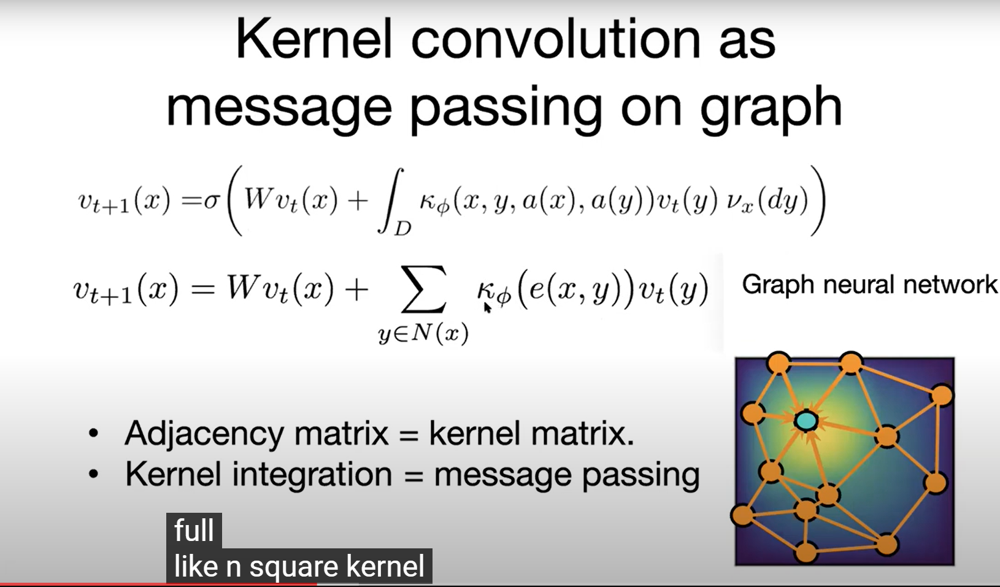

 ## 1. graph kernel network

#### 格林函数

对于下面一个PDE：

$a\in A$；边界$D\subset R^d$；

我们可以定义格林函数G：$D\times D\rightarrow R$作为下面这个问题的unique solution：
$$
L_a G(x,\cdot)=\delta_X
$$
G将会依赖于参数a，因此我们可以写成$G_a$，然后（4）式的解可以写成：
$$
u(x)=\int_D G_a(x,y)f(y)dy
$$
上式可以很容易证明：

#### 图神经网络算子

参照（2）式，我们可以定义一个神经网络，对于迭代结构$t=0,1,\dots ,T-1$；
$$
v_{t+1)}(x)=\sigma\{W_{v_t}(x)+\int_D\kappa_\phi[x,y,a(x)]v_t(y)\nu_x(dy)\}
$$
$\nu_x$ is a fixed Borel measure for each  $x\in D$；即是是实数上包含所有[区间](https://zh.wikipedia.org/wiki/區間)的最小[σ代数](https://zh.wikipedia.org/wiki/Σ-代数)；常用勒贝格测度(Lebesgue measure)在[测度论](https://zh.wikipedia.org/wiki/测度论)中，**勒贝格测度**（Lebesgue measure）是[欧几里得空间](https://zh.wikipedia.org/wiki/欧几里得空间)上的标准测度。对维数为1，2，3的情况，勒贝格测度就是通常的长度、面积、体积

$\kappa_\phi$：神经网络映射$R^{2(d+1)}\rightarrow R^{n\times n}$

#### 网络架构

$v_0$是初始猜测；

## 2. Fourier Neural Network

之前的图网络用的是迭代方法，速度非常慢（主要计算K这个积分算子核太花时间），计算复杂度为$O(N^2)$​；通过傅里叶变换可以减弱这一问题。

#### Neural Operator

#### Fourier Neural Operator

傅里叶变换的定义为：

把上面的积分核算子用傅里叶变换来代替

#### 离散傅里叶变换

#### 网络架构

#### 物理解释

傅里叶变换相当于把数据映射到不同的频率域，所以具有全局的correlation，而CNN只能提取局部的特征[Anima Anandkumar - AI4Science: A Revolution in the Making (April 21, 2021) - YouTube-26:00](https://youtu.be/JZVghfOmhPQ?list=PLVNifWxslHCDBMTlTpZlHymOhPtchk9mz&t=1527)

#### 捕捉频谱的能力

与loss function相关

**sobolev norm**

$$\|u\|_{H^1(\Omega)} = \sqrt{\int_\Omega |u(x)|^2 \, dx + \int_\Omega |u'(x)|^2 \, dx}$$​

$$\Vert u\Vert_{H^2}=\left(\Vert u\Vert_{L^2}^2+\Vert\Delta u\Vert_{L^2}^2\right)^{\frac{1}{2}}.$$

**$L^2$​ norm**：$$||\phi(x)||_{L^2}=\int |\phi(x)|^2dx$$​；需要开根号？

#### discrete or continuous

CNN 和u-net都是离散的vector-vector mapping

而这里是function-function map

why？我猜是因为积分算子的存在？

#### 图神经网络

mesh关系

也许是invariant的关  键

[Zongyi Li's talk on solving PDEs from data - YouTube](https://www.youtube.com/watch?v=0Ve9xwNJO2o)

#### encoder decoder

先用P把输入lift to higher dimension，（这与传统自编码不一样）

虽然FFT做了频率截断，但是之前升维了，在activation function和decoder中可以恢复高频信息  

#### 非周期条件

再fourier layer中，W可以处理非周期条件；

#### effect of  coordinate

格林函数依赖于coordinate； 所以不能随机sampling？

## 3. transformer

