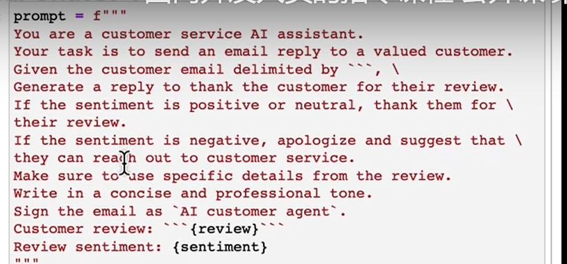
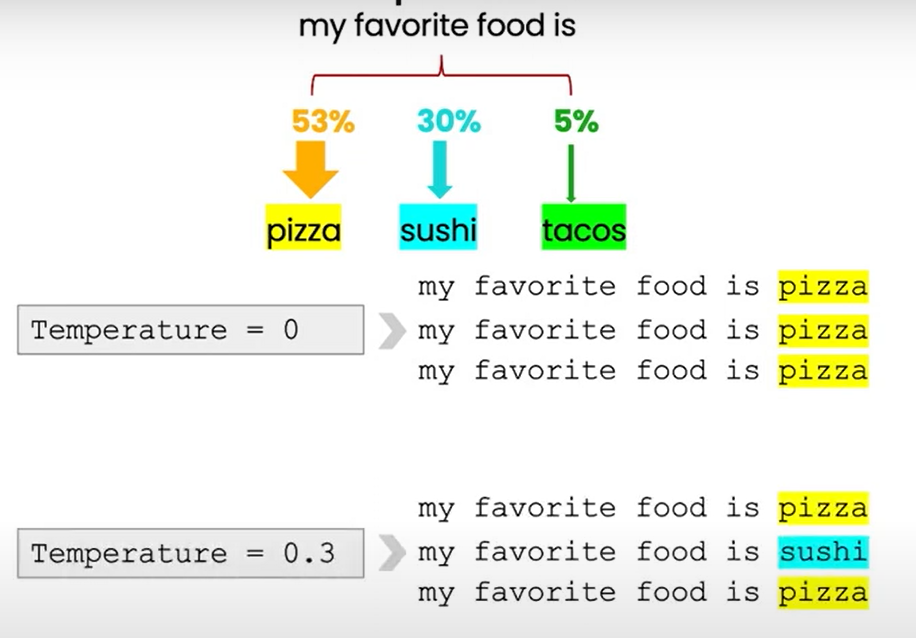
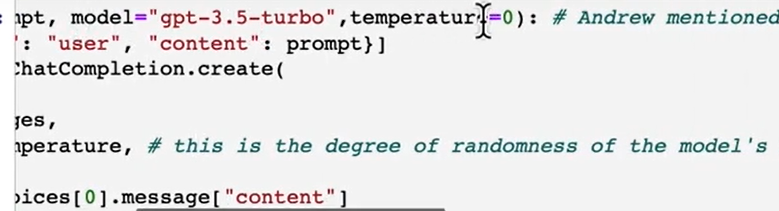
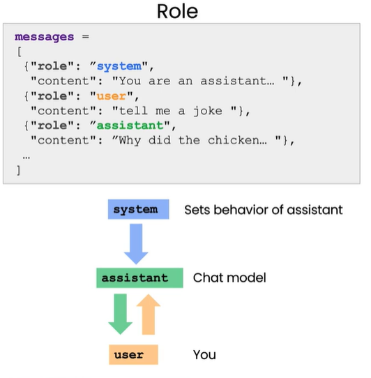

## 1. 用于总结

你可以要求限制字数，也可以提示就某一方面进行总结

## 2. 提取关键信息

比如评论的态度，用关键词/主题描述，提取品牌名称等等

## 3. transforming

#### 翻译

#### 语气转换

formal or informal

#### 文本格式转换

比如json to html

## 4. 生成长文：expanding

比如回复邮件

#### parameter：temperature

degree of exploration or randomness of model

## 5. 连续对话：building a chatbot

[DeepMind](https://arxiv.org/abs/2209.14375) 和 [Anthropic](https://arxiv.org/abs/2112.00861) 的相关研究指出，大语言模型 (LLM) 可以通过选取合适的文本提示 (prompt) 来转化为对话代理。这些文本提示通常包含一种所谓的“系统”信息来定义 LLM 的角色，以及一系列人机对话的示例。

有三个角色，

系统：定义整个框架

assistant：模型被系统定义的角色

user：用户

