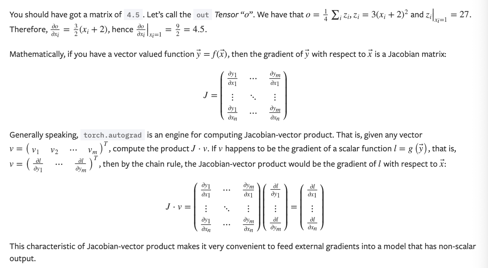

### 1. 张量

#### 1.1 追踪tensor以求导

`torch.Tensor` 是这个包的核心类。如果设置它的属性 `.requires_grad` 为 `True`，那么它将会追踪对于该张量的所有操作。当完成计算后可以通过调用 `.backward()`，来自动计算所有的梯度。这个张量的所有梯度将会自动累加到`.grad`属性.

#### 1.2 阻止追踪

可以调用 `.detach()` 方法将其与计算历史分离

可以将代码块包装在 `with torch.no_grad():` 中。在评估模型时特别有用，因为模型可能具有 `requires_grad = True` 的可训练的参数，但是我们不需要在此过程中对他们进行梯度计算。

如果需要计算导数，可以在 `Tensor` 上调用 `.backward()`。如果 `Tensor` 是一个标量(即它包含一个元素的数据），则不需要为 `backward()` 指定任何参数，但是如果它有更多的元素，则需要指定一个 `gradient` 参数，该参数是形状匹配的张量。

### 2. 梯度

现在开始进行反向传播，因为 `out` 是一个标量（即只包含一个元素的数据），因此 `out.backward()` 和 `out.backward(torch.tensor(1.))` 等价。

## 从后向中排除子图

两个标志：

- requires_grad
- volatile

#### 1. requires_grad

如果有一个单一的输入操作需要梯度，其输出也需要梯度。

相反，只有所有的输入都不需要梯度，输出才不需要

可以用来冻结模型中部分参数

#### 2. volatile

纯粹的inference模式下推荐使用`volatile`，当你确定你甚至不会调用`.backward()`时。它比任何其他自动求导的设置更有效——它将使用绝对最小的内存来评估模型。`volatile`也决定了`require_grad is False`。

## 自动求导如何编码历史信息

每个变量都有一个`.creator`属性，它指向把它作为输出的函数。

每次执行一个操作时，一个表示它的新`Function`就被实例化，它的`forward()`方法被调用，并且它输出的`Variable`的创建者被设置为这个`Function`。然后，通过跟踪从任何变量到叶节点的路径，可以重建创建数据的操作序列，并自动计算梯度。

#### 不建议用in-place操作

虽然它可以节省内存，但也容易出错

限制in-place操作适用性主要有两个原因：

１．覆盖梯度计算所需的值。这就是为什么变量不支持`log_`。它的梯度公式需要原始输入，而虽然通过计算反向操作可以重新创建它，但在数值上是不稳定的，并且需要额外的工作，这往往会与使用这些功能的目的相悖。

２．每个in-place操作实际上需要实现重写计算图。不合适的版本只需分配新对象并保留对旧图的引用，而in-place操作则需要将所有输入的`creator`更改为表示此操作的`Function`。这就比较棘手，特别是如果有许多变量引用相同的存储（例如通过索引或转置创建的），并且如果被修改输入的存储被任何其他`Variable`引用，则in-place函数实际上会抛出错误。

