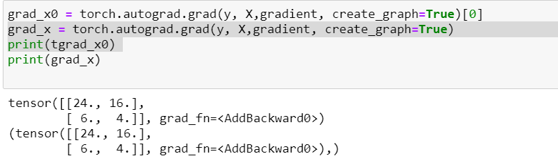

## 计算多元和高阶导数

$$
y = w_1  x^2 + w_2 t^2
$$

```python
def gra_fun(X):
    W=torch.tensor([[2.0],[2.0]])
    y=torch.matmul(X*X,W)
    #y=tf.sin(tf.matmul(X*X,w))
    return y
```

## 1. backward

返回的是torch.Tensor

- pytorch只能向量对向量求导，所以必须是y直接对x和t求导，不能对两者拼接的X求导 。

-  向量对向量求导需要设置*grad_tensors*，它与x和y的size一致；

- 如果需要求高阶导，设置requires_grad=True；同时，第一次求导后要清零，否则梯度会累加

```python
x = Variable(torch.tensor([[4.0],[1.0]]),requires_grad=True)
t = Variable(torch.tensor([[8.0],[2.0]]),requires_grad=True)
X = torch.cat([x,t],1)
#Variable(torch.tensor([[4.0,8.0],[1.0,2.0]]),requires_grad=True)
W=torch.tensor([[2.0],[2.0]])
#y=torch.matmul(X*X,W)
y=gra_fun(X)
print(y)
#gradient=torch.tensor([[1.0],[1.0]])
#x.grad.data.zero_()
#t.grad.data.zero_()
y.backward(torch.tensor([[1.0],[1.0]]),create_graph=True)

y_x=x.grad
#y.backward(torch.tensor([[1.0],[1.0]]),create_graph=True)
y_t=t.grad


print(y_x)
print(y_t)
x.grad.data.zero_()
y_x.backward(torch.tensor([[1.0],[1.0]]),create_graph=True)

print(x.grad)
```

#### 如何设定求导的leaf variavble

```python
x = torch.tensor([[4.0],[1.0]])
t = torch.tensor([[8.0],[2.0]])
X = Variable(torch.cat([x,t],1),requires_grad=True)
#Variable(torch.tensor([[4.0,8.0],[1.0,2.0]]),requires_grad=True)
W=torch.tensor([[2.0],[2.0]])
#y=torch.matmul(X*X,W)
y=gra_fun(X)
#print(y)
#gradient=torch.tensor([[1.0],[1.0]])
#x.grad.data.zero_()
#t.grad.data.zero_()
y.backward(torch.tensor([[1.0],[1.0]]),create_graph=True)

y_x=x.grad
#y.backward(torch.tensor([[1.0],[1.0]]),create_graph=True)
y_t=t.grad


print(y_x)
print(y_t)
```
输出：
> None
> None

## 2. grad

返回的是tuple。

直接指定y对x求导
```python
gradient=torch.tensor([[1.0],[1.0]])
#后面加[0]可以把tuple变成tensor类型，非常重要
grad_x = torch.autograd.grad(y, x,gradient, create_graph=True)[0]
print(grad_x) 
grad_y_x = torch.autograd.grad(grad_x, x,gradient, create_graph=True)
print(grad_y_x) 
```



#### 2.2 多元高阶导数

$$ y = X^3\bigodot W$$

$$y_{1,m} = W_1X_1^3+W_2X_2^3+...+W_nX_n^3$$

最简单的理解是这里和多维y对一维x求导一样，只是这里的$y\neq w_1x_1$，而是它们的和，但是对于求导没有影响

$$
\frac{dy}{dx}=\\
\begin{pmatrix}\frac{dy_1}{dx_{1,1}}& \frac{dy_{1}}{dx_{1,2}}& \cdots & \frac{dy_1}{dx_{1,n}}\\
\vdots & \vdots & \ddots & \vdots \\
\frac{dy_{m}}{dx_{m,1}} & \frac{dy_{m}}{dx_{m,2}} & \cdots &\frac{dy_{m}}{dx_{m,n}}\end{pmatrix}
$$


```python
def gra_fun(X):
    W=torch.tensor([[2.0],[4.0]])
    y=torch.matmul(X**3,W)
    #y=tf.sin(tf.matmul(X*X,w))
    return y
```


```python
gradient=torch.ones_like(x)
grad_x = torch.autograd.grad(y, X,torch.ones_like(y), create_graph=True)[0]
print(grad_x) 
```

> ```
> tensor([[ 96., 768.],
>         [  6.,  48.]], grad_fn=<MulBackward0>)
> ```

```python
grad_y_x = torch.autograd.grad(grad_x[:,0:1], X,torch.ones_like(x), create_graph=True)
print(grad_y_x) 
```

> ```
> (tensor([[48.,  0.],
>         [12.,  0.]], grad_fn=<MulBackward0>),)
> ```

```python
grad_y_x = torch.autograd.grad(grad_x[:,1:2], X,torch.ones_like(x), create_graph=True)
print(grad_y_x) 
```

> ```
> (tensor([[  0., 192.],
>         [  0.,  48.]], grad_fn=<MulBackward0>),)
> ```

**注意不能直接对x对二阶导数。**


结果表明，确实不能直接求二阶导。因为涉及到累加过程。如果直接求，结果是两者的累加。

同时发现，一阶导也不能这样计算

## 结论

多输入多输出的导数要分开计算，完全不能一起计算。