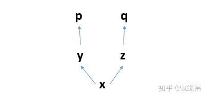
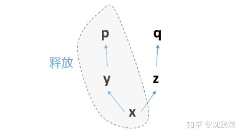
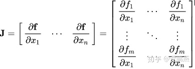
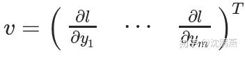
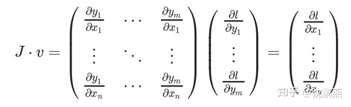

### 0. backpropagation

back propagation是用来计算损失函数的梯度的。

某种程度上，back propagation就是链式法则的别名


#### 1. tensor的创建于属性设置

关键是对要求导的量的requires_grad属性设置为true
```python
#创建一个二元函数，即z=f(x,y)=x2+y2，x可求导，y设置不可求导
x=torch.tensor(3.0,requires_grad=True)
y=torch.tensor(4.0,requires_grad=False)
z=torch.pow(x,2)+torch.pow(y,2)

#判断x,y是否是可以求导的
print(x.requires_grad)
print(y.requires_grad)
print(z.requires_grad)

#求导，通过backward函数来实现
z.backward()

#查看导数，也即所谓的梯度
print(x.grad)
print(y.grad)
```
#### 2. leaf variable的requires_grad_()方法

如果某一个叶子变量，开始时不可导的，后面想设置它可导，或者反过来，该怎么办呢？tensor提供了一个方法，即

x.requires_grad_(True/False) 设置tensor的可导与不可导，注意后面有一个**下划线**哦！

但是需要注意的是，我只能够设置叶子变量，即leaf variable的这个方法，否则会出现以下错误：

>  RuntimeError: you can only change requires_grad flags of leaf variables.


## 2. 函数求导——backward()方法

需要注意的是：如果出现了复合函数，比如 y是x的函数，z是y的函数，f是z的函数，那么在求导的时候，会使用 f.backwrad()只会默认求f对于**叶子变量**leaf variable的导数值，而对于中间变量y、z的导数值是不知道的，直接通过x.grad是知道的   y.grad、z.grad的值为none。

#### backward定义

backward(*grad_tensors=None*, *retain_graph=None*, *create_graph=False*, *grad_variables=None*)

### 2.1 默认求导法则

在pytorch里面，默认：只能是【标量】对【标量】，或者【标量】对向【量/矩阵】求导！这个很关键，很重要！

#### 2.1.1 标量对标量

#### 2.1.2 标量对向量求导

为什么标量对于向量/矩阵是默认的呢？因为在深度学习中，我们一般在求导的时候是对损失函数求导，损失函数一般都是一个标量，即讲所有项的损失加起来，但是参数又往往是向量或者是矩阵，所以这就是默认的了。看下面的例子。

比如有一个输入层为3节点的输入层，输出层为一个节点的输出层，这样一个简单的神经网络，针对以组样本而言，有

X=（x1,x2,x3）=(1.5,2.5,3.5)，X是（1,3）维的，输出层的权值矩阵为W=（w1,w2,w3）T=(0.2,0.4,0.6).T，这里表示初始化的权值矩阵，T表示转置，则W表示的是（3,1）维度，偏置项为b=0.1,是一个标量，则可以构建一个模型如下：

Y=XW+b，其中W,b就是要求倒数的变量，这里Y是一个标量，W是向量，b是标量，W,b是叶节点，leaf variable，

### 2.2 向量对向量求导

通过backward的第一个参数gradient来实现

```python
x = torch.tensor([[1.,2.,3.],[4.,5.,6.]],requires_grad=True)
y = torch.add(torch.pow(x,2),x)

gradient=torch.tensor([[1.0,1.0,1.0],[1.0,1.0,1.0]])

y.backward(gradient)

print(x.grad)

'''运行结果为：
tensor([[ 3., 5., 7.],
[ 9., 11., 13.]])
'''
```

gradient参数的维度与最终的函数y保持一样的形状，每一个元素表示当前这个元素所对应的权

### 2.3 backward()后面两个参数的作用

#### 2.3.1 retain_graph

默认是求一次导计算图就销毁，因此为了保留运算图多次求导，这里要设置为True

在构建函数关系的时候，特别是多个复合函数的时候，会有一个运算图，比如下面：



则有如下一些函数关系：

p=f(y)——>y=f(x)

q=f(z)——>z=f(x)

一个计算图在进行反向求导之后，为了节省内存，这个计算图就销毁了。 如果你想再次求导，就会报错。

就比如这里的例子而言，

你先求p求导，那么这个过程就是反向的p对y求导，y对x求导。 求导完毕之后，这三个节点构成的计算子图就会被释放：



那么计算图就只剩下z、q了，已经不完整，无法求导了。 **所以这个时候，无论你是想再次运行`p.backward()`还是`q.backward()`，都无法进行**，**因为x已经被销毁了，**报错如下：

> RuntimeError: Trying to backward through the graph a second time, but the buffers have already been freed. Specify retain_graph=True when calling backward the first time.

#### 2.3.2 create_graph

求高阶导数

#### 2.3.3 向量于向量求导的解释

即gradient参数的作用 。

如果一个向量X = [x1, x2，…xn]通过f(X) = [f1, f2，…fn]来计算其他向量，则雅可比矩阵(J)包含以下所有偏导组合：



注意：雅可比矩阵实现的是 n维向量 到 m 维向量的映射。

雅克比矩阵

上面的矩阵表示f(X)相对于X的梯度。

假设一个启用PyTorch梯度的张量X：

X = [x1,x2,…,xn]

X经过一些运算形成一个向量Y

Y = f(X) = [y1, y2，…,ym]

然后使用Y计算标量损失l。**假设向量v恰好是标量损失l关于向量Y的梯度**，如下：（注意体会这句话，这个很重要！）



向量v称为**`grad_tensor（梯度张量）`**，并作为参数传递给`backward()` 函数。

为了得到损失的**梯度l关于权重X**的梯度，雅可比矩阵**J**是向量乘以向量**v**



这种计算雅可比矩阵并将其与向量**v**相乘的方法使PyTorch能够轻松地**为非标量输出提供外部梯度**。


参考：https://zhuanlan.zhihu.com/p/84812085