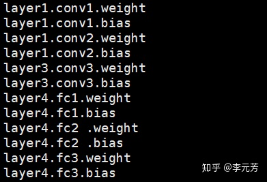

## named_parameters()

给出网络层的名字和参数的迭代器

```python3
for param in model.named_parameters():
    print(param[0])
# 得到所有层名字
```



## parameters()

给出一个网络全部参数的迭代器

print(type(model.parameters())) # 返回的是一个generator

