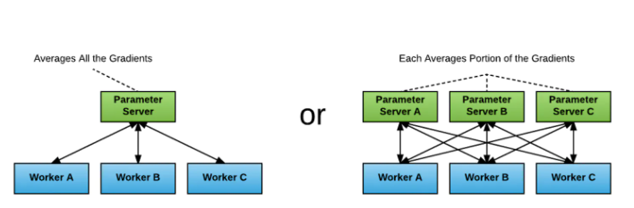
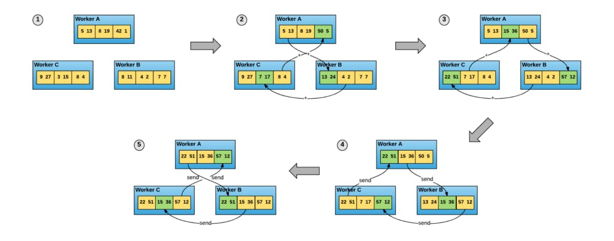
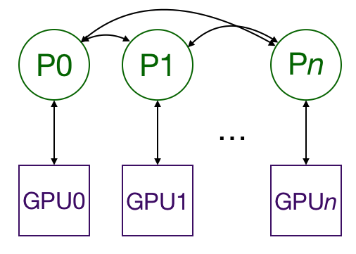

### 如何配置主进程和分进程

第一种方式复杂度为$O(N^2)$，而且收到最慢进程的限制（需要等待所有进程完成再处理参数）；

第二种当中，每一个进程保留完整的模型权重，但是只有batch片段的梯度更新且直接平均；这叫 **all-reduce algorithm**

[Distributed model training in PyTorch using DistributedDataParallel (spell.ml)](https://spell.ml/blog/pytorch-distributed-data-parallel-XvEaABIAAB8Ars0e)

## DistributedDataParallel

每个GPU上一个进程，且只有梯度互相传递

训练时，每一个进程从**disk**加载自己的mini-batch

每一个网络层的梯度不依赖于前一层？？

### 可能的问题

1. GPU0的内存不够，因为所有的out都要到上面

解决方案：

1. 减少batch
2. 使用apex

参考：[How to scale training on multiple GPUs | by Giuliano Giacaglia | Towards Data Science](https://towardsdatascience.com/how-to-scale-training-on-multiple-gpus-dae1041f49d2)