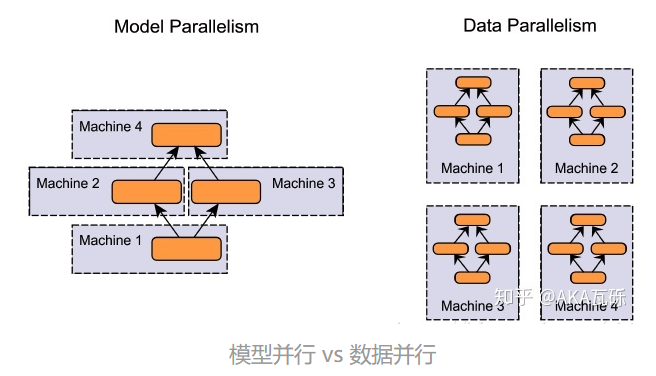

### 理论基础

#### 模型并行与数据并行

#### 同步更新与异步更新

- 同步更新：每个batch所有GPU计算完成后，再统一计算新权值，然后所有GPU同步新值后，再进行下一轮计算。
- 异步更新：每个GPU计算完梯度后，无需等待其他更新，立即更新整体权值并同步。

同步更新有等待，速度取决于最慢的那个GPU；异步更新没有等待，但是涉及到更复杂的梯度过时，loss下降抖动大的问题。所以实践中，**一般使用同步更新**的方式。

#### 参数同步的算法

假设有5张GPU：

- Parameter Server：GPU 0将数据分成五份分到各个卡上，每张卡负责自己的那一份mini-batch的训练，得到grad后，返回给GPU 0上做累积，得到更新的权重参数后，再分发给各个卡。
- Ring AllReduce：5张以环形相连，每张卡都有左手卡和右手卡，一个负责接收，一个负责发送，循环4次完成梯度累积，再循环4次做参数同步。分为Scatter Reduce和All Gather两个环节。

Parameter Server的思想其实有点类似于MapReduce，以上讲同步异步的时候，都是用的这种算法，但是它存在两个缺点：

1. 每一轮的训练迭代都需要所有卡都将数据同步完做一次Reduce才算结束，并行的卡很多的时候，木桶效应就会很严重，计算效率低。
2. 所有的GPU卡需要和Reducer进行数据、梯度和参数的通信，当模型较大或者数据较大的时候，通信开销很大。

参考：[【分布式训练】单机多卡的正确打开方式（一）：理论基础 - 知乎 (zhihu.com)](https://zhuanlan.zhihu.com/p/72939003)