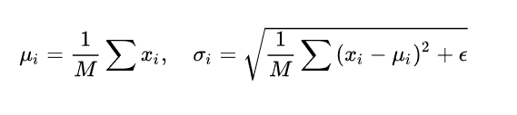
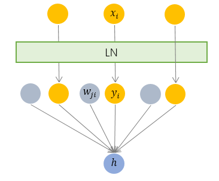
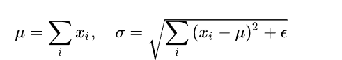
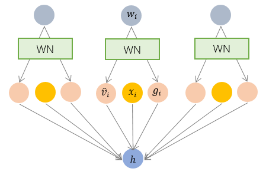

### 0. 为什么需要normalization

解决Internal Covariate Shift问题。：在训练的过程中，即使对输入层做了归一化处理使其变成标准正态，随着网络的加深，函数变换越来越复杂，许多隐含层的分布还是会彻底放飞自我，变成各种奇奇怪怪的正态分布，并且整体分布逐渐往非线性函数(也就是激活函数)的取值区间的上下限两端靠近。对于sigmoid函数来说，就意味着输入值是大的负数或正数，这导致反向传播时底层神经网络的梯度消失，这是训练深层神经网络收敛越来越慢的本质原因。

Normalization 的通用公式：

$$h=f(g\cdot \frac{x-\mu}{\sigma}+b)$$

对照于这一公式，我们来梳理主流的四种规范化方法。

### 1. BN( batch normalization)--纵向规范化

由于 BN 是针对单个维度定义的，因此标准公式中的计算均为 element-wise 的。

这就要求 每一个 mini-batch 的统计量是整体统计量的近似估计，或者说每一个 mini-batch 彼此之间，以及和整体数据，都应该是近似同分布的。分布差距较小的 mini-batch 可以看做是为规范化操作和模型训练引入了噪声，可以增加模型的[鲁棒性](https://www.zhihu.com/search?q=鲁棒性&search_source=Entity&hybrid_search_source=Entity&hybrid_search_extra={"sourceType"%3A"article"%2C"sourceId"%3A33173246})；但如果每个 mini-batch的原始分布差别很大，那么不同 mini-batch 的数据将会进行不一样的数据变换，这就增加了模型训练的难度。

因此，BN 比较适用的场景是：每个 mini-batch 比较大，数据分布比较接近。在进行训练之前，要做好充分的 shuffle. 否则效果会差很多。

由于 BN 需要在运行过程中统计每个 mini-batch 的一阶统计量和二阶统计量，因此不适用于 动态的网络结构 和 RNN 网络

所谷歌在2015年就提出了Batch Normalization(BN)，该方法对每个mini-batch都进行normalize，下图是BN的计算方式，会把mini-batch中的数据正规化到均值为0，标准差为1，同时还引入了两个可以学的参数，分别为scale和shift，让模型学习其适合的分布。那么为什么在做过正规化后，又要scale和shift呢？当通过正规化后，把尺度缩放到0均值，再scale和shift，不是有可能把数据变回"原样"？因为scale和shift是模型自动学习的，神经网络可以自己琢磨前面的正规化有没有起到优化作用，没有的话就"反"正规化，抵消之前的正规化操作带来的影响。

#### 作用

- 解决梯度消失
- 解决internal convariate shift问题
- 加速模型收敛
- 具有正则化效果

以实际使用上，BatchNorm层应该放在哪呢？层与层直接都要加吗？加在激活函数前还是激活函数后？卷积层和pooling层要不要加？有人说这个应该加在非线性层后，如下顺序。

**Linear->Relu->BatchNorm->Dropout**

论文里有提到，BN层常常被加到Relu之前，但是没有明确的标准，需要尝试不同配置，通过实验得出结论(很多实验结果偏向于Relu在BN之前)。

1、BN层可以缓解梯度消失，解决ICS问题，加速模型的收敛，并且具有正则化效果。

2、 BN层往往添加在Relu层后，Dropout层之前。

[聊聊Batch Normalization在网络结构中的位置 - 云+社区 - 腾讯云 (tencent.com)](https://cloud.tencent.com/developer/article/1835245)

### 2. Layer Normalization —— 横向规范化

LN 针对单个训练样本进行，不依赖于其他数据，因此可以避免 BN 中受 mini-batch 数据分布影响的问题，可以用于 小mini-batch场景、动态网络场景和 RNN，特别是自然语言处理领域。此外，LN 不需要保存 mini-batch 的均值和方差，节省了额外的存储空间

### 3. **Weight Normalization —— 参数规范化**

BN 和 LN 均将规范化应用于输入的特征数据x，BN 和 LN 均将规范化应用于输入的特征数据w。

 

参考：[详解深度学习中的Normalization，BN/LN/WN - 知乎 (zhihu.com)](https://zhuanlan.zhihu.com/p/33173246)