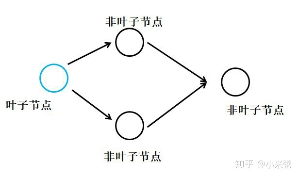

A leaf Variable is a variable that is at the beginning of the graph. That means that no operation tracked by the autograd engine created it.
This is what you want when you optimize neural networks as it is usually your weights or input.

So to be able to give weights to the optimizer, they should follow the definition of leaf variable above.

```python
a = torch.rand(10, requires_grad=True) # a is a leaf variable
a = torch.rand(10, requires_grad=True).double() # a is NOT a leaf variable as it was created by the operation that cast a float tensor into a double tensor
a = torch.rand(10).requires_grad_().double() # equivalent to the formulation just above: not a leaf variable
a = torch.rand(10).double() # a does not require gradients and has not operation creating it (tracked by the autograd engine).
a = torch.rand(10).doube().requires_grad_() # a requires gradients and has no operations creating it: it's a leaf variable and can be given to an optimizer.
a = torch.rand(10, requires_grad=True, device="cuda")  # a requires grad, has not operation creating it: it's a leaf variable as well and can be given to an optimizer 
```


### 叶子节点的概念




参考：https://discuss.pytorch.org/t/valueerror-cant-optimize-a-non-leaf-tensor/21751

https://zhuanlan.zhihu.com/p/85506092