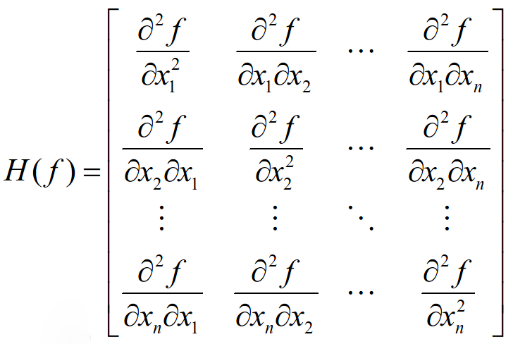

### 海塞Hessian矩阵



考虑一个函数：
$$
f(x)=b^Tx+\frac{1}{2}x^{T}Ax\\其中b^T=[1,3,5], A在代码中可读，可以自定义
$$


**求该函数在x=[0,0,0]的海塞矩阵**：

```python
import torch
 
 
# 定义函数
x = torch.tensor([0., 0, 0], requires_grad=True)
b = torch.tensor([1., 3, 5])
A = torch.tensor([[-5, -3, -0.5], [-3, -2, 0], [-0.5, 0, -0.5]])
y = b@x + 0.5*x@A@x
 
# 计算一阶导数,因为我们需要继续计算二阶导数,所以创建并保留计算图
grad = torch.autograd.grad(y, x, retain_graph=True, create_graph=True)
# 定义Print数组,为输出和进一步利用Hessian矩阵作准备
Print = torch.tensor([])
for anygrad in grad[0]:  # torch.autograd.grad返回的是元组
    Print = torch.cat((Print, torch.autograd.grad(anygrad, x, retain_graph=True)[0]))
print(Print.view(x.size()[0], -1))
```


参考：

https://www.cnblogs.com/chester-cs/p/11755279.html