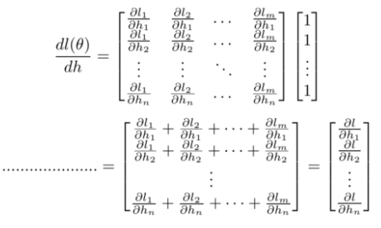
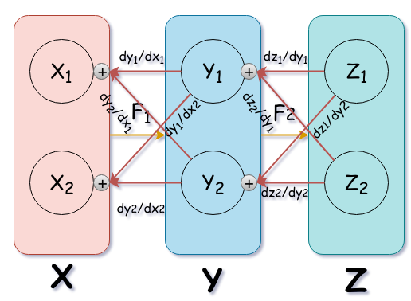
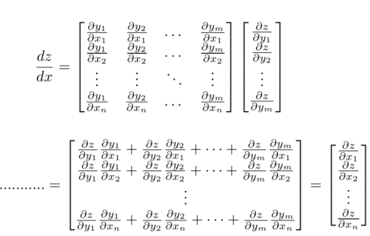

## 0. 求导布局的概念

#### 分子布局

即雅可比矩阵
$$
\frac{\partial  \mathbf{y}}{\partial \mathbf{x}} = \left( \begin{array}{ccc} \frac{\partial y_1}{\partial x_1}& \frac{\partial y_1}{\partial x_2}& \ldots & \frac{\partial y_1}{\partial x_n}\\  \frac{\partial y_2}{\partial x_1}& \frac{\partial y_2}{\partial x_2} & \ldots & \frac{\partial y_2}{\partial x_n}\\   \vdots&  \vdots &  \ddots & \vdots \\ \frac{\partial y_m}{\partial x_1}& \frac{\partial y_m}{\partial x_2} & \ldots & \frac{\partial y_m}{\partial x_n}  \end{array} \right)
$$

#### 分母布局

一般叫梯度矩阵，有的用$\frac{\partial \mathbf{y^T}}{\partial \mathbf{x}}$来定义梯度矩阵，意义是一样的。
$$
\frac{\partial  \mathbf{y}}{\partial \mathbf{x}} = \left( \begin{array}{ccc} \frac{\partial y_1}{\partial x_1}& \frac{\partial y_2}{\partial x_1}& \ldots & \frac{\partial y_m}{\partial x_1}\\  \frac{\partial y_1}{\partial x_2}& \frac{\partial y_2}{\partial x_2} & \ldots & \frac{\partial y_m}{\partial x_2}\\   \vdots&  \vdots &  \ddots & \vdots \\ \frac{\partial y_1}{\partial x_n}& \frac{\partial y_2}{\partial x_n} & \ldots & \frac{\partial y_m}{\partial x_n}  \end{array} \right)
$$

一般来说我们会使用一种叫混合布局的思路，即

- 如果是**向量或者矩阵对标量**求导，则使用**分子布局**为准，
- 如果是**标量对向量或者矩阵**求导，则以**分母布局**为准。

## 1. 向量对向量求导

#### 1.1 the Jacobian-vector product

#### 1.2 Jacobian-vector product in backpropagation

在反向传播中，z是叶节点；

this way we can we can just keep multiplying the gradients vectors of descendent nodes in our computational graph with full — Jacobians of their ancestors backward to the leaf nodes.
and we can interpret the ones vector that we provide to the backward() function as **an external gradients from which the chain rule starts the multiplication process!**

使用Jacobian-vector product 可以有效减少内存。

参考：

https://www.cnblogs.com/pinard/p/10750718.html 

https://www.cnblogs.com/pinard/p/10773942.html