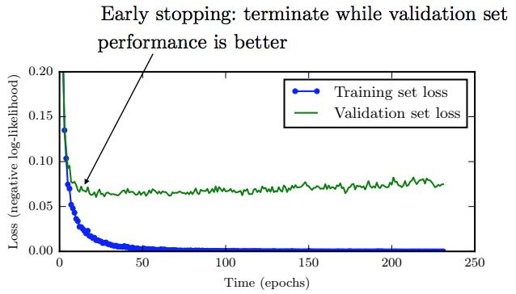

通常对于较大的模型，我们会观察到训练集上的误差不断减小，但验证集上的误差会在某个点之后反而逐渐增大，这意味着为了减小泛化误差，我们可以在训练过程中不断的记录验证集上的误差及对应的模型参数，最终返回验证集上误差最小所对应的模型参数，这个简单直观的方法就是early stopping，由于其简单高效，在深度学习中得到了广泛应用。



下面在pytorch上面运用早停法（early stopping)

#Train the Model using Early Stopping
def train_model(model, batch_size, patience, n_epochs):
    
```python
# to track the training loss as the model trains
train_losses = []
# to track the validation loss as the model trains
valid_losses = []
# to track the average training loss per epoch as the model trains
avg_train_losses = []
# to track the average validation loss per epoch as the model trains
avg_valid_losses = [] 

# initialize the early_stopping object
early_stopping = EarlyStopping(patience=patience, verbose=True)

for epoch in range(1, n_epochs + 1):
 
    ###################
    # train the model #
    ###################
    model.train() # prep model for training
    for batch, (data, target) in enumerate(train_loader, 1):
        # clear the gradients of all optimized variables
        optimizer.zero_grad()
        # forward pass: compute predicted outputs by passing inputs to the model
        output = model(data)
        # calculate the loss
        loss = criterion(output, target)
        # backward pass: compute gradient of the loss with respect to model parameters
        loss.backward()
        # perform a single optimization step (parameter update)
        optimizer.step()
        # record training loss
        train_losses.append(loss.item())
 
    ######################    
    # validate the model #
    ######################
    model.eval() # prep model for evaluation
    for data, target in valid_loader:
        # forward pass: compute predicted outputs by passing inputs to the model
        output = model(data)
        # calculate the loss
        loss = criterion(output, target)
        # record validation loss
        valid_losses.append(loss.item())
 
    # print training/validation statistics 
    # calculate average loss over an epoch
    train_loss = np.average(train_losses)
    valid_loss = np.average(valid_losses)
    avg_train_losses.append(train_loss)
    avg_valid_losses.append(valid_loss)
    
    epoch_len = len(str(n_epochs))
    
    print_msg = (f'[{epoch:>{epoch_len}}/{n_epochs:>{epoch_len}}] ' +
                 f'train_loss: {train_loss:.5f} ' +
                 f'valid_loss: {valid_loss:.5f}')
    
    print(print_msg)
    
    # clear lists to track next epoch
    train_losses = []
    valid_losses = []
    
    # early_stopping needs the validation loss to check if it has decresed, 
    # and if it has, it will make a checkpoint of the current model
    early_stopping(valid_loss, model)
    
    if early_stopping.early_stop:
        print("Early stopping")
        break
    
# load the last checkpoint with the best model
model.load_state_dict(torch.load('checkpoint.pt'))
 
return  model, avg_train_losses, avg_valid_losses
```
具体的完整代码为：https://github.com/Bjarten/early-stopping-pytorch/blob/master/MNIST_Early_Stopping_example.ipynb
————————————————
版权声明：本文为CSDN博主「哗啦呼啦嘿」的原创文章，遵循CC 4.0 BY-SA版权协议，转载请附上原文出处链接及本声明。
原文链接：https://blog.csdn.net/weixin_40446557/article/details/103387629

