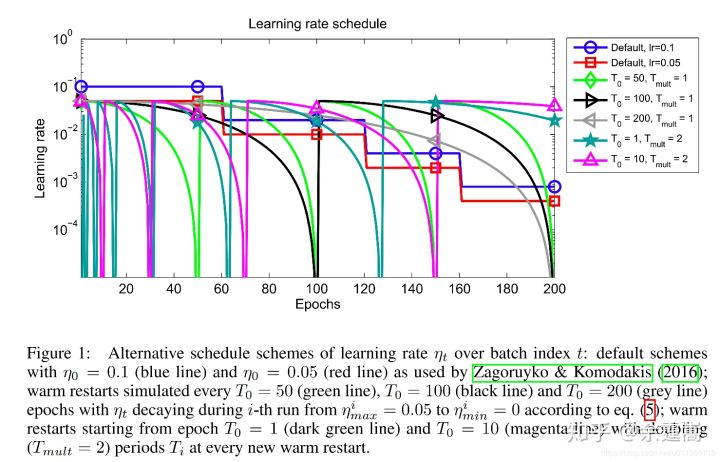

## `torch.optim.lr_scheduler`

在一定数量的epochs之后提供调整步长的方法

```python
model = [Parameter(torch.randn(2, 2, requires_grad=True))]
optimizer = SGD(model, 0.1)
scheduler = ExponentialLR(optimizer, gamma=0.9)

for epoch in range(20):
    for input, target in dataset:
        optimizer.zero_grad()
        output = model(input)
        loss = loss_fn(output, target)
        loss.backward()
        optimizer.step()
    scheduler.step()
```

#### epoch和iteration的区别

epoch表示对整个训练集传播一次（前向传播+后向传播）；

由于考虑内存不够的问题，通常会用batch 训练，所以iteration指使用一个batch size样本传播一次。


### 六种学习率调整方法

#### StepLR

**功能：** **等间隔调整学习率，调整倍数为gamma倍**，调整间隔为step_size。间隔单位是step。需要注意的是，step通常是指epoch，不要弄成iteration了

#### MultiStepLR

按设定的间隔调整学习率。这个方法适合后期调试使用，观察loss曲线，为每个实验定制学习率调整时机。

#### ExponentialLR

用指数衰减调整学习率

#### CosineAnnealingLR

 以余弦函数为周期，并在每个周期最大值时重新设置学习率。具体如下图所示



### CyclicLR

周期性学习率

CLR是Leslie Smith于2015年提出的。这是一种调节LR的方法，在该方法中，设定一个LR上限和下限，LR的值在上限和下限的区间里周期性地变化。看上去，CLR似乎是自适应LR技术和SGD的竞争者，事实上，CLR技术是可以和上述提到的改进的优化器一起使用来进行参数更新的。

直觉上看，随着训练次数的增加我们应该保持学习率一直减小以便于在某一时刻达到收敛。

然而，事实恰与直觉相反，使用一个在给定区间里周期性变化的LR可能更有用处。原因是周期性高的学习率能够使模型跳出在训练过程中遇到的局部最低点和鞍点。事实上，Dauphin等[3]指出相比于局部最低点，鞍点更加阻碍收敛。如果鞍点正好发生在一个巧妙的平衡点，小的学习率通常不能产生足够大的梯度变化使其跳过该点（即使跳过，也需要花费很长时间）。这正是周期性高学习率的作用所在，它能够更快地跳过鞍点

[周期性学习率(Cyclical Learning Rate)技术 | LonePatient'Blog](https://lonepatient.top/2018/09/25/Cyclical_Learning_Rate)


[torch.optim — PyTorch 1.9.0 documentation](https://pytorch.org/docs/stable/optim.html?highlight=lr_scheduler)

[PyTorch 学习笔记（八）：PyTorch的六个学习率调整方法 - 知乎 (zhihu.com)](https://zhuanlan.zhihu.com/p/69411064)