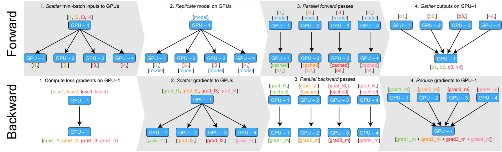

## DataParallel

### 步骤

1. gpu0：分割mini-batch
2. 每一份batch移动到不同的GPU
3. 模型复制到倒是有GPU
4. 正向计算
5. 在GPU:0计算loss，返回loss到不同的GPU并计算梯度
6. 在GPU:0求梯度和并使用优化器

参考：[How to scale training on multiple GPUs | by Giuliano Giacaglia | Towards Data Science](https://towardsdatascience.com/how-to-scale-training-on-multiple-gpus-dae1041f49d2)