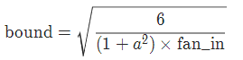
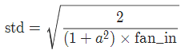

#### Linear层

定义：

> CLASStorch.nn.Linear(in_features, out_features, bias=True)

$$
y = xW^T+b
$$

注意这里用了转置。
所以设置的w的shape为 (out\_features, in\_features)

https://blog.csdn.net/shanglianlm/article/details/85165523

#### 使用numpy初始化

```python
# 定义一个 Sequential 模型
net1 = nn.Sequential(
    nn.Linear(30, 40),
    nn.ReLU(),
    nn.Linear(40, 50),
    nn.ReLU(),
    nn.Linear(50, 10)
)
# 定义一个 Sequential 模型
net1 = nn.Sequential(
    nn.Linear(30, 40),
    nn.ReLU(),
    nn.Linear(40, 50),
    nn.ReLU(),
    nn.Linear(50, 10)
)
```

注意，这是一个 Parameter，也就是一个特殊的 Variable，我们可以访问其 `.data`属性得到其中的数据，然后直接定义一个新的 Tensor 对其进行替换，我们可以使用 PyTorch 中的一些随机数据生成的方式，比如 `torch.randn`，如果要使用更多 PyTorch 中没有的随机化方式，可以使用 numpy

```python
# 定义一个 Tensor 直接对其进行替换
net1[0].weight.data = torch.from_numpy(np.random.uniform(3, 5, size=(40, 30)))
```

循环去访问，比如

```python
for layer in net1:
    if isinstance(layer, nn.Linear): # 判断是否是线性层
        param_shape = layer.weight.shape
        layer.weight.data = torch.from_numpy(np.random.normal(0, 0.5, size=param_shape)) 
        # 定义为均值为 0，方差为 0.5 的正态分布
```


**Xavier**初始化

这种初始化的公式

$$
w\ \sim \ Uniform[- \frac{\sqrt{6}}{\sqrt{n*j + n*{j+1}}}, \frac{\sqrt{6}}{\sqrt{n*j + n*{j+1}}}]
$$

其中 $n*j$ 和 $n*{j+1}$ 表示该层的输入和输出数目，所以请尝试实现以下这种初始化方式

对于 Module 的参数初始化，其实也非常简单，如果想对其中的某层进行初始化，可以直接像 Sequential 一样对其 Tensor 进行重新定义，其唯一不同的地方在于，如果要用循环的方式访问，需要介绍两个属性，children 和 modules

 ## 初始化方法

#### 0. 默认初始化方法

**注意：**在Linear中，默认初始化是kaiming初始化方法，参考：https://github.com/pytorch/pytorch/blob/master/torch/nn/modules/linear.py#L86-L96

权重alues are initialized from$ \mathcal{U}(-\sqrt{k}, \sqrt{k})U(−*k*,*k*) $, where $k = \frac{1}{\text{in\_features}}$,*k*=in_features;

**bias** – the learnable bias of the module of shape ($\text{out\_features}$)(out_features) . If `bias` is `True`, the values are initialized from $\mathcal{U}(-\sqrt{k}, \sqrt{k})U(−*k*,*k*)$ where $k = \frac{1}{\text{in\_features}}$*k*=in_features1

类似于均匀分布初始化，a=1/in_fetures.in_features是输入node数量。

#### 1. 常数初始化

torch.nn.init.constant_(tensor, val)

#### 2. 均匀分布初始化

torch.nn.init.uniform_(tensor, a=0, b=1)

#### 3. 正态分布初始化

从给定均值和标准差的正态分布N(mean, std)中生成值，填充输入的张量或变量

```
torch.nn.init.normal_(tensor, mean=0, std=1)
```

#### 4. Xavier正态分布

用一个正态分布生成值，填充输入的张量或变量。结果张量中的值采样自均值为0，标准差为gain * sqrt(2/(fan_in + fan_out))的正态分布。也被称为Glorot initialisation.

torch.nn.init.xavier_normal_(tensor, gain=1)

#### 5. Xavier均匀分布
用一个均匀分布生成值，填充输入的张量或变量。结果张量中的值采样自U(-a, a)，其中a= gain * sqrt( 2/(fan_in + fan_out))* sqrt(3). 该方法也被称为Glorot initialisation

```
torch.nn.init.xavier_uniform_(tensor, gain=1)
```

#### 6. kaiming 均匀分布

用一个均匀分布生成值，填充输入的张量或变量。结果张量中的值采样自U(-bound, bound)，其中


```
torch.nn.init.kaiming_uniform_(tensor, a=0, mode='fan_in', nonlinearity='leaky_relu')
```

#### 7. kaiming 正态分布

用一个正态分布生成值，填充输入的张量或变量。结果张量中的值采样自N(0,std)N(0,std)*N*(0,*s**t**d*)的正态分布。


```
torch.nn.init.kaiming_normal_(tensor, a=0, mode='fan_in', nonlinearity='leaky_relu')
```

#### 8. 单位矩阵初始化

#### 9. 正交初始化

#### 10. 稀疏初始化

#### 11.狄拉克δ函数初始化

使用狄拉克δ函数填充输入的torch.Tensor。

```
torch.nn.init.dirac_(tensor)
```


参考：https://wizardforcel.gitbooks.io/learn-dl-with-pytorch-liaoxingyu/3.5.html

