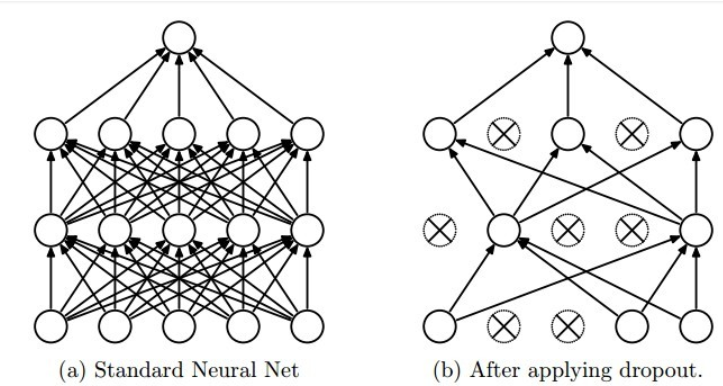

前面我们讲了数据增强和 dropout，而在实际使用中，现在的网络往往不使用 dropout，而是用另外一个技术，叫正则化。

正则化是机器学习中提出来的一种方法，有 L1 和 L2 正则化L2 regularization是减小权重的大小，而L1 regularization会使权重更稀疏

目前使用较多的是 L2 正则化，引入正则化相当于在 loss 函数上面加上一项，比如
$$
f = loss + \lambda \sum_{p \in params} ||p||_2^2
$$

就是在 loss 的基础上加上了参数的二范数作为一个正则化，我们在训练网络的时候，不仅要最小化 loss 函数，同时还要最小化参数的二范数，也就是说我们会对参数做一些限制，不让它变得太大。当 $\lambda$为零时，正则项为零， $\lambda$越大，则正则化越显著

如果我们对新的损失函数 f 求导进行梯度下降，就有

$$
\frac{\partial f}{\partial p_j} = \frac{\partial loss}{\partial p_j} + 2 \lambda p_j
$$

那么在更新参数的时候就有

$$
p_j \rightarrow p_j - \eta (\frac{\partial loss}{\partial p_j} + 2 \lambda p_j) = p_j - \eta \frac{\partial loss}{\partial p_j} - 2 \eta \lambda p_j
$$

可以看到 $p_j - \eta \frac{\partial loss}{\partial p_j}$ 和没加正则项要更新的部分一样，而后面的 $2\eta \lambda p_j$ 就是正则项的影响，可以看到加完正则项之后会对参数做更大程度的更新，这也被称为权重衰减(weight decay)，在 pytorch 中正则项就是通过这种方式来加入的，比如想在随机梯度下降法中使用正则项，或者说权重衰减，`torch.optim.SGD(net.parameters(), lr=0.1, weight_decay=1e-4)` 就可以了，这个 `weight_decay` 系数就是上面公式中的 $\lambda$，非常方便

注意正则项的系数的大小非常重要，如果太大，会极大的抑制参数的更新，导致欠拟合，如果太小，那么正则项这个部分基本没有贡献，所以选择一个合适的权重衰减系数非常重要，这个需要根据具体的情况去尝试，初步尝试可以使用 `1e-4` 或者 `1e-3`

下面我们在训练 cifar 10 中添加正则项

```python
import sys
sys.path.append('..')

import numpy as np
import torch
from torch import nn
import torch.nn.functional as F
from torch.autograd import Variable
from torchvision.datasets import CIFAR10
from utils import train, resnet
from torchvision import transforms as tfs
def data_tf(x):
    im_aug = tfs.Compose([
        tfs.Resize(96),
        tfs.ToTensor(),
        tfs.Normalize([0.5, 0.5, 0.5], [0.5, 0.5, 0.5])
    ])
    x = im_aug(x)
    return x

train_set = CIFAR10('./data', train=True, transform=data_tf)
train_data = torch.utils.data.DataLoader(train_set, batch_size=64, shuffle=True, num_workers=4)
test_set = CIFAR10('./data', train=False, transform=data_tf)
test_data = torch.utils.data.DataLoader(test_set, batch_size=128, shuffle=False, num_workers=4)

net = resnet(3, 10)
optimizer = torch.optim.SGD(net.parameters(), lr=0.01, weight_decay=1e-4) # 增加正则项
criterion = nn.CrossEntropyLoss()
from utils import train
train(net, train_data, test_data, 20, optimizer, criterion)
```

> Epoch 0. Train Loss: 1.429834, Train Acc: 0.476982, Valid Loss: 1.261334, Valid Acc: 0.546776, Time 00:00:26
Epoch 1. Train Loss: 0.994539, Train Acc: 0.645400, Valid Loss: 1.310620, Valid Acc: 0.554688, Time 00:00:27
Epoch 2. Train Loss: 0.788570, Train Acc: 0.723585, Valid Loss: 1.256101, Valid Acc: 0.577433, Time 00:00:28
Epoch 3. Train Loss: 0.629832, Train Acc: 0.780411, Valid Loss: 1.222015, Valid Acc: 0.609474, Time 00:00:27
Epoch 4. Train Loss: 0.500406, Train Acc: 0.825288, Valid Loss: 0.831702, Valid Acc: 0.720332, Time 00:00:27
Epoch 5. Train Loss: 0.388376, Train Acc: 0.868646, Valid Loss: 0.829582, Valid Acc: 0.726760, Time 00:00:27
Epoch 6. Train Loss: 0.291237, Train Acc: 0.902094, Valid Loss: 1.499777, Valid Acc: 0.623714, Time 00:00:28
Epoch 7. Train Loss: 0.222401, Train Acc: 0.925072, Valid Loss: 1.832660, Valid Acc: 0.558643, Time 00:00:28
Epoch 8. Train Loss: 0.157753, Train Acc: 0.947990, Valid Loss: 1.255313, Valid Acc: 0.668117, Time 00:00:28
Epoch 9. Train Loss: 0.111407, Train Acc: 0.963595, Valid Loss: 1.004693, Valid Acc: 0.724782, Time 00:00:27
Epoch 10. Train Loss: 0.084960, Train Acc: 0.972926, Valid Loss: 0.867961, Valid Acc: 0.775119, Time 00:00:27
Epoch 11. Train Loss: 0.066854, Train Acc: 0.979280, Valid Loss: 1.011263, Valid Acc: 0.749604, Time 00:00:28
Epoch 12. Train Loss: 0.048280, Train Acc: 0.985534, Valid Loss: 2.438345, Valid Acc: 0.576938, Time 00:00:27
Epoch 13. Train Loss: 0.046176, Train Acc: 0.985614, Valid Loss: 1.008425, Valid Acc: 0.756527, Time 00:00:27
Epoch 14. Train Loss: 0.039515, Train Acc: 0.988411, Valid Loss: 0.945017, Valid Acc: 0.766317, Time 00:00:27
Epoch 15. Train Loss: 0.025882, Train Acc: 0.992667, Valid Loss: 0.918691, Valid Acc: 0.784217, Time 00:00:27
Epoch 16. Train Loss: 0.018592, Train Acc: 0.994985, Valid Loss: 1.507427, Valid Acc: 0.680281, Time 00:00:27
Epoch 17. Train Loss: 0.021062, Train Acc: 0.994246, Valid Loss: 2.976452, Valid Acc: 0.558940, Time 00:00:27
Epoch 18. Train Loss: 0.021458, Train Acc: 0.993926, Valid Loss: 0.927871, Valid Acc: 0.785898, Time 00:00:27
Epoch 19. Train Loss: 0.015656, Train Acc: 0.995824, Valid Loss: 0.962502, Valid 