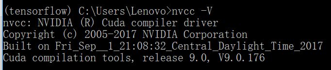
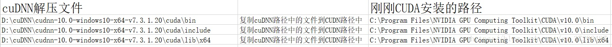
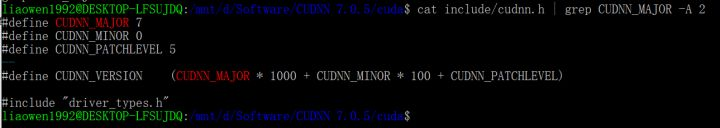
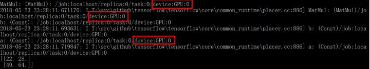

第0步：  

先安装anaconda（我是之前安装过anaconda3）

这里是安装GPU类型，不是CPU

第1步：

确定电脑的GPU型号，查看是否支持CUDA

#### 第2步：

查看tensorflow安装版本所要求的CUDA版本和Cmake

我的：

tensorflow1.2

**cuda**：8.1.44：https://developer.download.nvidia.cn/compute/cuda/8.0/secure/prod/local_installers/cuda_8.0.44_win10.exe?JF84ksLF8CnxDDCQa-w4HPaWNmDNYPaaNxHmUII9IsDQb-ay5UnrloNClJmwnSBmm11n9bO6YQhOOlNgSbXQyMoq_gEJUKDFPHSVYmMmk2uWQzIfenP1bDwNBv6YM8jtzTbnVf8NLXu3YZA96I-VNUAEEs5_kr1sBvSRYW8ugW6hCQ


>  Windows下cuda注意选择自定义安装--》只安装cuda，因为典型安装会安装其他组件，造成黑屏。

安装好之后，输入：
```powershell
nvcc -V
```
如果显示如下，则安装成功




**cudnn**：[cudnn-8.0-windows10-x64-v5.1](https://developer.download.nvidia.cn/compute/machine-learning/cudnn/secure/v5.1/prod_20161129/8.0/cudnn-8.0-windows10-x64-v5.1.zip?imzldFlpFfG4z7-s74KB5o1Gz0aJLDzoa9xlUz1cx28eVrRUPNzi5YDu66oDBAh-BQSZ-cwug8OrGQwH05WQ_HabvyEF1l4QDt8irDaJJWxNq6GuFCvnWAQB00e3-dYjnLcnLPETnX9e1hjkon7pX4CWpb4RxRQJu7Iv9YsqICbxnBlgN98817xhTtIFHFm31uas-yNHZ0BY883a)

1. 下载CUDNN后,复制粘贴cuDNN里面的下面三个文件到CUDA的相应同名文件（我使用的）

- cudnn\cuda\bin => CUDA\v10.0\bin
- cudnn\cuda\include => CUDA\v10.0\include
- cudnn\lib\x64 => CUDA\v10.0\lib\x64



把cuda/bin路径加入系统环境变量中

2. 或者进入该软件包，使用bash

```shell
cat include/cudnn.h | grep CUDNN_MAJOR -A 2
```

如果显示如下图就说明安装成功




奇怪的是我没有用bazel编译

#### 第3步

anaconda安装tensorflow

在ANACONDA里创建名为TENSORFLOW的环境（你可以叫他任何名字，这里我叫这个环境为TENSORFLOW。（可能不了解python版本，可以或者直接先创建环境，再用conda安装）

```text
conda create -n tensorflow pip python=3.6
```

这里pip python=3.6的意思是在名为tensorflow的环境里搭建版本是3.6的python。

2）发出以下命令以激活 conda 环境：

**activate tensorflow**


如果想要**检测tensorflow的确用gpu来做运算**了，请用以下脚本测试

```text
import tensorflow as tf
# Creates a graph.
a = tf.constant([1.0, 2.0, 3.0, 4.0, 5.0, 6.0], shape=[2, 3], name='a')
b = tf.constant([1.0, 2.0, 3.0, 4.0, 5.0, 6.0], shape=[3, 2], name='b')
c = tf.matmul(a, b)
# Creates a session with log_device_placement set to True.
sess = tf.Session(config=tf.ConfigProto(log_device_placement=True))
# Runs the op.
print(sess.run(c))
```

测试结果如下图



图中

```text
device:GPU:0
```

的意思就是说该运算用到了GPU。

如果想手动声明让电脑用CPU运算，请参考官方文档

主要参考：https://zhuanlan.zhihu.com/p/37086409