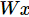

#### 设计思想

由于python调用外部语言实现一些计算（比如numpy库会调用底层的c++？函数做矩阵运算）的过程中，在内外部切换的开销很大，无论用GPU还是分布式，这些开销都不可避免，而且更大。

解决的方案是：在TF中，先用`图`描述一系列可交互的操作，最后全部一起放到python外运行，这也是很多机器学习库中的一种技巧。


## 1. 构造模型

#### 1. palcehodler

表示一个占位符，一般用于表示输入的一些不可改变的值（比如training data？？）


#### 2. Variable

可以修改的张量，如W和b，以及其他模型参数


#### 3. matmul

`tf.matmul(X，W)`表示`x`乘以`W`，对应之前等式里面的

matmul是矩阵点乘，X维度是I，J，W的维度必须为J，K，得到的结果是一个I，K维度的矩阵。

现在我们就构造好模型了。

```python
y = tf.nn.softmax(tf.matmul(x,W) + b)
```


## 2. 训练模型

先要用placeholder添加一个占位符用于输入正确值；

然后计算cost函数，如交叉熵：

```python
cross_entropy = -tf.reduce_sum(y_*tf.log(y))
```

用优化算法训练：

```python
train_step = tf.train.GradientDescentOptimizer(0.01).minimize(cross_entropy)
```


现在可以启动我们的模型：

先初始化所有变量；

```python
init = tf.initialize_all_variables()
```

再建立session启动模型并初始化变量：

```python
sess = tf.Session()
sess.run(init)
```

最后开始训练模型，这里循环1000次：

```python
for i in range(1000):
  batch_xs, batch_ys = mnist.train.next_batch(100)
  sess.run(train_step, feed_dict={x: batch_xs, y_: batch_ys})
```

该循环的每个步骤中，我们都会随机抓取训练数据中的100个批处理数据点，然后我们用这些数据点作为参数替换之前的占位符来运行`train_step`

#### 反馈

执行每一步时，我们的代码会生成一个反馈字典（feed dictionary），其中包含对应步骤中训练所要使用的例子，这些例子的哈希键就是其所代表的占位符操作。

`fill_feed_dict`函数会查询给定的`DataSet`，索要下一批次`batch_size`的图像和标签，与占位符相匹配的Tensor则会包含下一批次的图像和标签。

```python
feed_dict = {
    images_placeholder: images_feed,
    labels_placeholder: labels_feed,
}
```

这个字典随后作为`feed_dict`参数，传入`sess.run()`函数中，为这一步的训练提供输入样例

#### 检查状态

在运行`sess.run`函数时，要在代码中明确其需要获取的两个值：`[train_op, loss]`。

```python
for step in xrange(FLAGS.max_steps):
    feed_dict = fill_feed_dict(data_sets.train,
                               images_placeholder,
                               labels_placeholder)
    _, loss_value = sess.run([train_op, loss],
                             feed_dict=feed_dict)
```

因为要获取这两个值，`sess.run()`会返回一个有两个元素的元组。其中每一个`Tensor`对象，对应了返回的元组中的numpy数组，而这些数组中包含了当前这步训练中对应Tensor的值。由于`train_op`并不会产生输出，其在返回的元祖中的对应元素就是`None`，所以会被抛弃。但是，如果模型在训练中出现偏差，`loss` Tensor的值可能会变成NaN，所以我们要获取它的值，并记录下来。

假设训练一切正常，没有出现NaN，训练循环会每隔100个训练步骤，就打印一行简单的状态文本，告知用户当前的训练状态。

```python
if step % 100 == 0:
    print 'Step %d: loss = %.2f (%.3f sec)' % (step, loss_value, duration)
```

## 评估模型


