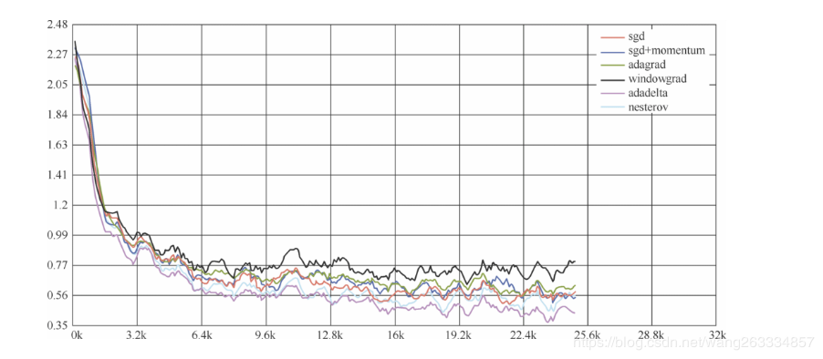
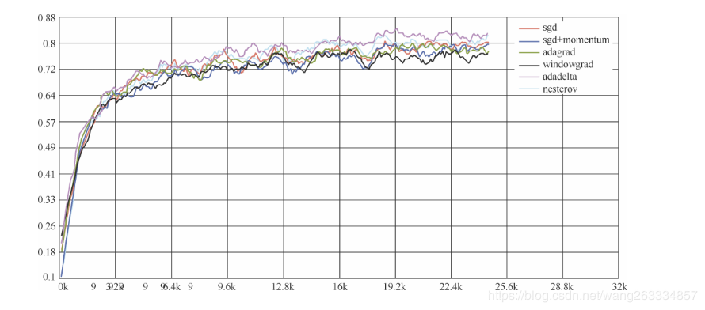
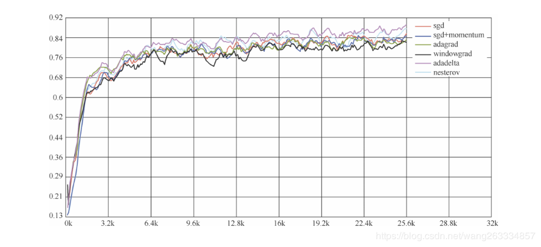

如何加速神经网络的训练呢？目前加速训练的优化方法基本都是基于梯度下降的，只是细节上有些差异。梯度下降是求函数极值的一种方法，学习到最后就是求损失函数的极值问题。

TensorFlow提供了很多优化器 （optimizer），我们重点介绍下面这8个：

```python
class tf.train.GradientDescentOptimizer
class tf.train.AdadeltaOptimizer
class tf.train.AdagradOptimizer
class tf.train.AdagradDAOptimizer
class tf.train.MomentumOptimizer
class tf.train.AdamOptimizer
class tf.train.FtrlOptimizer
class tf.train.RMSPropOptimizer
```

这8个优化器对应8种优化方法，分别是梯度下降法（BGD和SGD）、Adadelta法、Adagrad法（Adagrad和AdagradDAO）、Momentum法（Momentum和Nesterov Momentum）、Adam、Ftrl法和RMSProp法，其中BGD、SGD、Momentum和Nesterov Momentum是手动指定学习率的，其余算法能够自动调节学习率。

下面就介绍其中几种优化方法。

1．BGD法

BGD的全称是batch gradient descent，即批梯度下降。这种方法是利用现有参数对训练集中的每一个输入生成一个估计输出yi ，然后跟实际输出yi 比较，统计所有误差，求平均以后得到平均误差，以此作为更新参数的依据。它的迭代过程为：

（1）提取训练集中的所有内容{x 1 , …, xn }，以及相关的输出yi ；

（2）计算梯度和误差并更新参数。

这种方法的优点是，使用所有训练数据计算，能够保证收敛，并且不需要逐渐减少学习率；缺点是，每一步都需要使用所有的训练数据，随着训练的进行，速度会越来越慢。

那么，如果将训练数据拆分成一个个批次（batch），每次抽取一批数据来更新参数，是不是会加速训练呢？这就是最常用的SGD。

2．SGD法

SGD的全称是stochastic gradient descent，即随机梯度下降。因为这种方法的主要思想是将数据集拆分成一个个批次（batch），随机抽取一个批次来计算并更新参数，所以也称为MBGD（minibatch gradient descent）。

SGD在每一次迭代计算mini-batch的梯度，然后对参数进行更新。与BGD相比，SGD在训练数据集很大时，仍能以较快的速度收敛。但是，它仍然会有下面两个缺点。

（1）由于抽取不可避免地梯度会有误差，需要手动调整学习率 （learning rate），但是选择合适的学习率又比较困难。尤其在训练时，我们常常想对常出现的特征更新速度快一些，而对不常出现的特征更新速度慢一些，而SGD在更新参数时对所有参数采用一样的学习率，因此无法满足要求。

（2）SGD容易收敛到局部最优，并且在某些情况下可能被困在鞍点。

为了解决学习率固定的问题，又引入了Momentum法。

3．Momentum法

Momentum是模拟物理学中动量的概念，更新时在一定程度上保留之前的更新方向，利用当前的批次再微调本次的更新参数，因此引入了一个新的变量v（速度），作为前几次梯度的累加。因此，Momentum能够更新学习率，在下降初期，前后梯度方向一致时，能够加速学习；在下降的中后期，在局部最小值的附近来回震荡时，能够抑制震荡，加快收敛。

4．Nesterov Momentum法

Nesterov Momentum法由Ilya Sutskever在Nesterov工作的启发下提出的，是对传统Momentum法的一项改进，其基本思路如图4-6所示。

 

图4-6 

标准Momentum法首先计算一个梯度（短的1号线），然后在加速更新梯度的方向进行一个大的跳跃（长的1号线）；Nesterov项首先在原来加速的梯度方向进行一个大的跳跃（2号线），然后在该位置计算梯度值（3号线），然后用这个梯度值修正最终的更新方向（4号线）。

上面介绍的优化方法都需要我们自己设定学习率，接下来介绍几种自适应学习率的优化方法。

5．Adagrad法

Adagrad法能够自适应地为各个参数分配不同的学习率，能够控制每个维度的梯度方向。这种方法的优点是能够实现学习率的自动更改：如果本次更新时梯度大，学习率就衰减得快一些；如果这次更新时梯度小，学习率衰减得就慢一些。

6．Adadelta法

Adagrad法仍然存在一些问题：其学习率单调递减，在训练的后期学习率非常小，并且需要手动设置一个全局的初始学习率。Adadelta法用一阶的方法，近似模拟二阶牛顿法，解决了这些问题。

7．RMSprop法

RMSProp法与Momentum法类似，通过引入一个衰减系数，使每一回合都衰减一定比例。在实践中，对循环神经网络（RNN）效果很好。

8．Adam法

Adam的名称来源于自适应矩估计 [20] （adaptive moment estimation）。Adam法根据损失函数针对每个参数的梯度的一阶矩估计和二阶矩估计动态调整每个参数的学习率。

9．各个方法的比较

Karpathy在MNIST数据集上用上述几个优化器做了一些性能比较，发现如下规律 [21] ：在不怎么调整参数的情况下，Adagrad法比SGD法和Momentum法更稳定，性能更优；精调参数的情况下，精调的SGD法和Momentum法在收敛速度和准确性上要优于Adagrad法。

各个优化器的损失值比较结果如图4-7所示。



图4-7

各个优化器的测试准确率比较如图4-8所示。



图4-8

各个优化器的训练准确率比较如图4-9所示。



图4-9

想要更深入研究各种优化方法，可以参考《An overview of gradient descent optimization algorithms》[22] 。


参考：[Tensorflow优化--CSDN](https://blog.csdn.net/wang263334857/article/details/89059194)