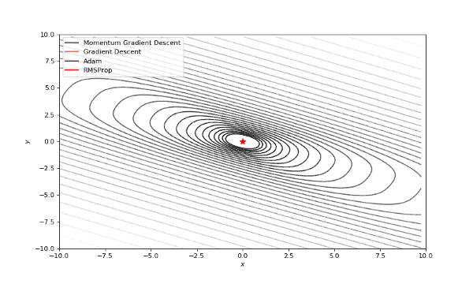

## 1. 优化函数

#### 1.1 **BOWL函数（呈碗状的函数）**

Bohachevsky函数和Trid函数

#### 1.2 **PLATE函数（呈板状）**

Booth、Matyas和Zakharov函数

#### 1.3 **VALLEY函数（呈谷状）**

Rozenbrock，Beale和Six Hump Camel函数


## 2. 算法

### 2.1 无梯度优化

通常我们的代价函数是嘈杂的或不可微分的，因此我们不能在这种情况下应用使用梯度的方法。在本教程中，我们比较了Nelder-Mead和Powell算法，它们不计算梯度。第一种方法构建（n + 1）维的单纯型（simplex），并在其上找到最小值，依次更新它。Powell方法在空间的每个基向量上进行一维搜索。使用SciPy实现如下：

```python
minimize（fun ，x0 ，method='Nelder-Mead'` `，tol=` `None` `，callback=` `make_minimize_cb ）
```

callback用于保存中间结果（取自上方链接的可视化教程）。

### 2.2 一阶算法

它们朝着反梯度的方向发展，得出函数的最小化。但这些算法移动到最小值的细节差别很大。我们使用Tensorflow来实现：梯度下降（有和没有），Adam和RMSProp。

#### SCIPY

在SciPy中我们使用共轭梯度法，牛顿共轭梯度法，截断牛顿法，序贯最小二乘设计法。你可以阅读更多关于这些算法的更多信息可以阅读Boyd and Vandenberghe写的[凸优化](https://link.zhihu.com/?target=https%3A//web.stanford.edu/~boyd/cvxbook/)。

SciPy接口或多或少与零阶方法相同。

### 2.3 二阶算法

我们还将碰到一些使用二阶导数加速收敛的算法：dog-leg信赖域, nearly exact信赖域。这些算法顺序地解决搜索区域（通常是球状）被发现的局部最优问题。我们知道，这些算法需要Hessian（或它的近似），所以我们使用numdifftools库来计算它们并传入SciPy优化器：


## 3. 超参数

### 3.1 学习率

首先，我想你已经注意到，像Adam和RMSprop这样流行的自适应算法与比SGD慢的多。但它们不是应该被设计成速度更快吗？这是因为这些损失曲面的学习率太低。参数必须分别针对每个问题进行调整。在下面的图片中，你可以看到如果将它的值增加到1会发生什么。



## 4. 机器学习

尝试SciPy中的算法可以直接再TensorFlow中使用，模块`tf.contrib.opt`


#### 参考资料

[机器学习优化函数的直观介绍--知乎](https://zhuanlan.zhihu.com/p/34305942)