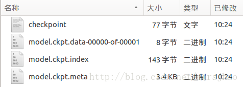

## 保存
#### tf.train.Saver

tf.train.Saver对象saver的save方法将TensorFlow模型保存到指定路径中，
```python
saver.save(sess,"Model/model.ckpt")
```
实际在这个文件目录下会生成4个文件：



model.ckpt.meta保存了TensorFlow计算图的结构信息，model.ckpt保存每个变量的取值，此处文件名的写入方式会因不同参数的设置而不同，但加载restore时的文件路径名是以checkpoint文件中的“model_checkpoint_path”值决定的。

## 加载
加载这个已保存的TensorFlow模型的方法是saver.restore(sess,"./Model/model.ckpt")，加载模型的代码中也要定义TensorFlow计算图上的所有运算并声明一个tf.train.Saver类，不同的是加载模型时不需要进行变量的初始化，而是将变量的取值通过保存的模型加载进来，注意加载路径的写法。若不希望重复定义计算图上的运算，可直接加载已经持久化的图，
```python
saver =tf.train.import_meta_graph("Model/model.ckpt.meta")
```


## 程序实现

```python

# 本文件程序为配合教材及学习进度渐进进行，请按照注释分段执行
# 执行时要注意IDE的当前工作过路径，最好每段重启控制器一次，输出结果更准确
 
 
# Part1: 通过tf.train.Saver类实现保存和载入神经网络模型
 
# 执行本段程序时注意当前的工作路径
import tensorflow as tf
 
v1 = tf.Variable(tf.constant(1.0, shape=[1]), name="v1")
v2 = tf.Variable(tf.constant(2.0, shape=[1]), name="v2")
result = v1 + v2
 
saver = tf.train.Saver()
 
with tf.Session() as sess:
    sess.run(tf.global_variables_initializer())
    saver.save(sess, "Model/model.ckpt")
 
 
# Part2: 加载TensorFlow模型的方法
 
import tensorflow as tf
 
v1 = tf.Variable(tf.constant(1.0, shape=[1]), name="v1")
v2 = tf.Variable(tf.constant(2.0, shape=[1]), name="v2")
result = v1 + v2
 
saver = tf.train.Saver()
 
with tf.Session() as sess:
    saver.restore(sess, "./Model/model.ckpt") # 注意此处路径前添加"./"
    print(sess.run(result)) # [ 3.]
 
 
# Part3: 若不希望重复定义计算图上的运算，可直接加载已经持久化的图
 
import tensorflow as tf
 
saver = tf.train.import_meta_graph("Model/model.ckpt.meta")
 
with tf.Session() as sess:
    saver.restore(sess, "./Model/model.ckpt") # 注意路径写法
    print(sess.run(tf.get_default_graph().get_tensor_by_name("add:0"))) # [ 3.]
 
 
# Part4： tf.train.Saver类也支持在保存和加载时给变量重命名
 
import tensorflow as tf
 
# 声明的变量名称name与已保存的模型中的变量名称name不一致
u1 = tf.Variable(tf.constant(1.0, shape=[1]), name="other-v1")
u2 = tf.Variable(tf.constant(2.0, shape=[1]), name="other-v2")
result = u1 + u2
 
# 若直接生命Saver类对象，会报错变量找不到
# 使用一个字典dict重命名变量即可，{"已保存的变量的名称name": 重命名变量名}
# 原来名称name为v1的变量现在加载到变量u1（名称name为other-v1）中
saver = tf.train.Saver({"v1": u1, "v2": u2})
 
with tf.Session() as sess:
    saver.restore(sess, "./Model/model.ckpt")
    print(sess.run(result)) # [ 3.]
 
 
# Part5: 保存滑动平均模型
 
import tensorflow as tf
 
v = tf.Variable(0, dtype=tf.float32, name="v")
for variables in tf.global_variables():
    print(variables.name) # v:0
 
ema = tf.train.ExponentialMovingAverage(0.99)
maintain_averages_op = ema.apply(tf.global_variables())
for variables in tf.global_variables():
    print(variables.name) # v:0
                          # v/ExponentialMovingAverage:0
 
saver = tf.train.Saver()
 
with tf.Session() as sess:
    sess.run(tf.global_variables_initializer())
    sess.run(tf.assign(v, 10))
    sess.run(maintain_averages_op)
    saver.save(sess, "Model/model_ema.ckpt")
    print(sess.run([v, ema.average(v)])) # [10.0, 0.099999905]
 
 
# Part6: 通过变量重命名直接读取变量的滑动平均值
 
import tensorflow as tf
 
v = tf.Variable(0, dtype=tf.float32, name="v")
saver = tf.train.Saver({"v/ExponentialMovingAverage": v})
 
with tf.Session() as sess:
    saver.restore(sess, "./Model/model_ema.ckpt")
    print(sess.run(v)) # 0.0999999
 
 
# Part7: 通过tf.train.ExponentialMovingAverage的variables_to_restore()函数获取变量重命名字典
 
import tensorflow as tf
 
v = tf.Variable(0, dtype=tf.float32, name="v")
# 注意此处的变量名称name一定要与已保存的变量名称一致
ema = tf.train.ExponentialMovingAverage(0.99)
print(ema.variables_to_restore())
# {'v/ExponentialMovingAverage': <tf.Variable 'v:0' shape=() dtype=float32_ref>}
# 此处的v取自上面变量v的名称name="v"
 
saver = tf.train.Saver(ema.variables_to_restore())
 
with tf.Session() as sess:
    saver.restore(sess, "./Model/model_ema.ckpt")
    print(sess.run(v)) # 0.0999999
 
 
# Part8: 通过convert_variables_to_constants函数将计算图中的变量及其取值通过常量的方式保存于一个文件中
 
import tensorflow as tf
from tensorflow.python.framework import graph_util
 
v1 = tf.Variable(tf.constant(1.0, shape=[1]), name="v1")
v2 = tf.Variable(tf.constant(2.0, shape=[1]), name="v2")
result = v1 + v2
 
with tf.Session() as sess:
    sess.run(tf.global_variables_initializer())
    # 导出当前计算图的GraphDef部分，即从输入层到输出层的计算过程部分
    graph_def = tf.get_default_graph().as_graph_def()
    output_graph_def = graph_util.convert_variables_to_constants(sess,
                                                        graph_def, ['add'])
 
    with tf.gfile.GFile("Model/combined_model.pb", 'wb') as f:
        f.write(output_graph_def.SerializeToString())
 
 
# Part9: 载入包含变量及其取值的模型
 
import tensorflow as tf
from tensorflow.python.platform import gfile
 
with tf.Session() as sess:
    model_filename = "Model/combined_model.pb"
    with gfile.FastGFile(model_filename, 'rb') as f:
        graph_def = tf.GraphDef()
        graph_def.ParseFromString(f.read())
 
    result = tf.import_graph_def(graph_def, return_elements=["add:0"])

————————————————
版权声明：本文为CSDN博主「marsjhao」的原创文章，遵循CC 4.0 BY-SA版权协议，转载请附上原文出处链接及本声明。
原文链接：https://blog.csdn.net/marsjhao/java/article/details/72829635
```

