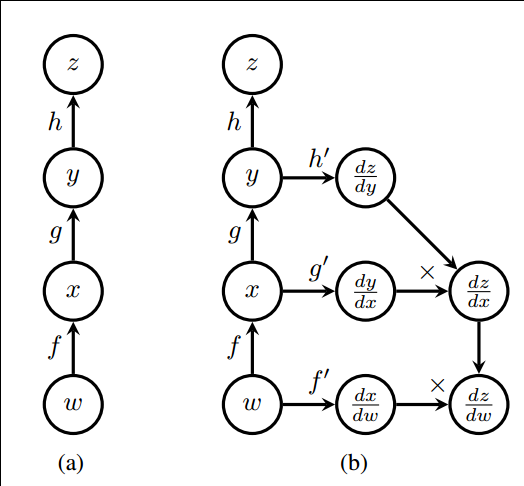

### 1. 综述

>使用图 (graph) 来表示计算任务.
>在被称之为 会话 (Session) 的上下文 (context) 中执行图.
>使用 tensor 表示数据.
>通过 变量 (Variable) 维护状态.
>使用 feed 和 fetch 可以为任意的操作(arbitrary operation) 赋值或者从其中获取数据.


TensorFlow 是一个编程系统, 使用图来表示计算任务. 图中的`节点`被称之为 op (operation 的缩写). 一个 op 获得 0 个或多个 Tensor, 执行计算, 产生 0 个或多个 Tensor. 每个 Tensor 是一个类型化的多维数组. 例如, 你可以将一小组图像集表示为一个四维浮点数数组, 这四个维度分别是 [batch, height, width, channels].
一个 TensorFlow 图描述了计算的过程. 为了进行计算, 图必须在 会话 里被启动. 会话 将图的 op 分发到诸如 CPU 或 GPU 之类的 设备 上, 同时提供执行 op 的方法. 这些方法执行后, 将产生的 tensor 返回. 在 Python 语言中, 返回的 tensor 是 numpy ndarray 对象; 在 C 和 C++ 语言中, 返回的 tensor 是 tensorflow::Tensor 实例.

### 2. 计算图

TensorFlow 程序通常被组织成一个构建阶段和一个执行阶段. 在构建阶段, op 的执行步骤 被描述成一个图. 在执行阶段, 使用会话执行执行图中的 op.
例如, **通常在构建阶段创建一个图来表示和训练神经网络, 然后在执行阶段反复执行图中的训练 op.**


自动微分



### 3. 构建图

是创建源 op (source op)。源 op 不需要任何输入，例如 常量 (Constant)。源 op 的输出被传递给其它 op 做运算。在创建源op的过程中，TensorFlow默认将这些新创的op添加到默认图中

```python
import tensorflow as tf

# 创建一个常量 op, 产生一个 1x2 矩阵. 这个 op 被作为一个节点
# 加到默认图中.
#
# 构造器的返回值代表该常量 op 的返回值.
matrix1 = tf.constant([[3., 3.]])

# 创建另外一个常量 op, 产生一个 2x1 矩阵.
matrix2 = tf.constant([[2.],[2.]])

# 创建一个矩阵乘法 matmul op , 把 'matrix1' 和 'matrix2' 作为输入.
# 返回值 'product' 代表矩阵乘法的结果.
product = tf.matmul(matrix1, matrix2)
```


### 4. 在会话中启动图

构造阶段完成后, 才能启动图. 启动图的第一步是创建一个 Session 对象, 如果无任何创建参数, 会话构造器将启动默认图.
欲了解完整的会话 API, 请阅读[session类](http://www.tensorfly.cn/tfdoc/api_docs/python/client.html#session-management).

```python
#启动默认图.
sess = tf.Session()

# 调用 sess 的 'run()' 方法来执行矩阵乘法 op, 传入 'product' 作为该方法的参数. 
# 上面提到, 'product' 代表了矩阵乘法 op 的输出, 传入它是向方法表明, 我们希望取回
# 矩阵乘法 op 的输出.
#
# 整个执行过程是自动化的, 会话负责传递 op 所需的全部输入. op 通常是并发执行的.
# 
# 函数调用 'run(product)' 触发了图中三个 op (两个常量 op 和一个矩阵乘法 op) 的执行.
#
# 返回值 'result' 是一个 numpy `ndarray` 对象.
result = sess.run(product)
print result
# ==> [[ 12.]]

# 任务完成, 关闭会话.
sess.close()
```

Session 对象在使用完后需要关闭以释放资源. 除了显式调用 close 外, 也可以使用 “with” 代码块 来自动完成关闭动作.

```python
with tf.Session() as sess:
  result = sess.run([product])
  print result
```

### 5. 交互使用

文档中的 Python 示例使用一个会话 Session 来 启动图, 并调用 Session.run() 方法执行操作.

为了便于使用诸如 IPython 之类的 Python 交互环境, 可以使用 InteractiveSession 代替 Session 类, 使用 Tensor.eval() 和 Operation.run() 方法代替 Session.run(). 这样可以避免使用一个变量来持有会话.

### 6. Fetch

为了取回操作的输出内容, 可以在使用 Session 对象的 run() 调用 执行图时, 传入一些 tensor, 这些 tensor 会帮助你取回结果. 在之前的例子里, 我们只取回了单个节点 state, 但是你也可以取回多个 tensor:

```python
input1 = tf.constant(3.0)
input2 = tf.constant(2.0)
input3 = tf.constant(5.0)
intermed = tf.add(input2, input3)
mul = tf.mul(input1, intermed)

with tf.Session():
  result = sess.run([mul, intermed])
  print result

# 输出:
# [array([ 21.], dtype=float32), array([ 7.], dtype=float32)]
```

需要获取的多个 tensor 值，在 op 的一次运行中一起获得（而不是逐个去获取 tensor）

### 7. Feed

类似于局部变量

TensorFlow 还提供了 feed 机制, 该机制 可以临时替代图中的任意操作中的 tensor 可以对图中任何操作提交补丁, 直接插入一个 tensor.

feed 使用一个 tensor 值**临时替换一个操作的输出结果**. 你可以提供 feed 数据作为 run() 调用的参数. feed 只**在调用它的方法内有效, 方法结束, feed 就会消失**. 最常见的用例是将某些特殊的操作指定为 “feed” 操作, 标记的方法是使用 tf.placeholder() 为这些操作创建占位符.

```python
input1 = tf.placeholder(tf.types.float32)
input2 = tf.placeholder(tf.types.float32)
output = tf.mul(input1, input2)

with tf.Session() as sess:
  print sess.run([output], feed_dict={input1:[7.], input2:[2.]})

# 输出:
# [array([ 14.], dtype=float32)]
```

#### 为什么要引入占位符以及feed？
feed_dict是一个字典，在字典中需要给出每一个用到的占位符的取值。在训练神经网络时需要每次提供一个批量的训练样本，**如果每次迭代选取的数据要通过常量表示，那么TensorFlow 的计算图会非常大。**因为每增加一个常量，TensorFlow 都会在计算图中增加一个结点。所以说拥有几百万次迭代的神经网络会拥有极其庞大的计算图，而占位符却可以解决这一点，它只会拥有占位符这一个结点。


参考:[CSDN-tensorflow运行过程及原理](https://blog.csdn.net/weixin_44075878/article/details/84981065)