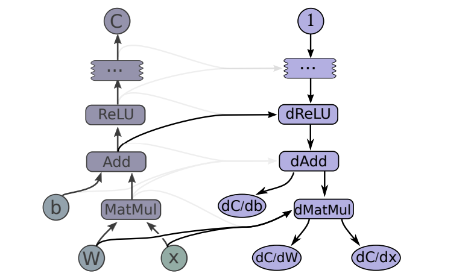
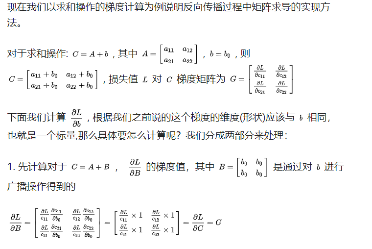
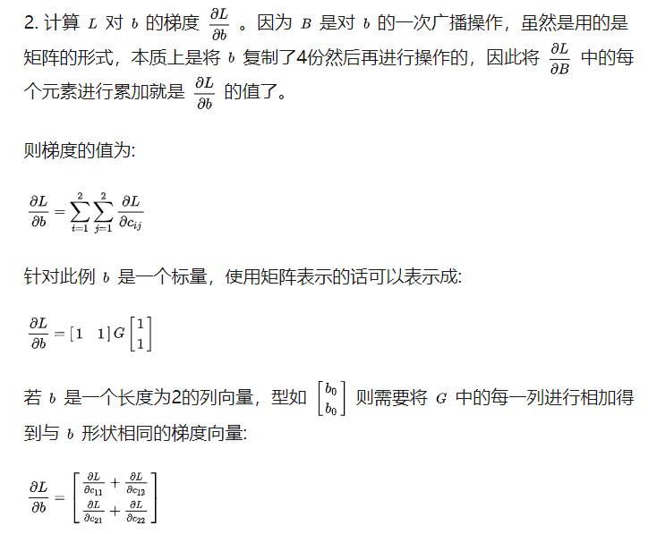

## tensorflow如何计算导数

[db,dW,dx] = tf.gradients(C, [b,W,x])

#### 以求和为例

#### 测试：

y=XW

X是一个4\*2的矩阵，W为2\*1的矩阵

对W求导的结果是一个2*1（与W的形状一样）的矩阵，也是X中每一列的值；导数第一行是X第一列的值，第二行是X第二列的值。

参考：https://www.zhihu.com/question/56443480

https://static.googleusercontent.com/media/research.google.com/en//pubs/archive/45166.pdf

https://zhuanlan.zhihu.com/p/33353929