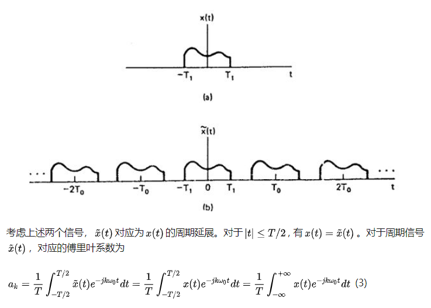
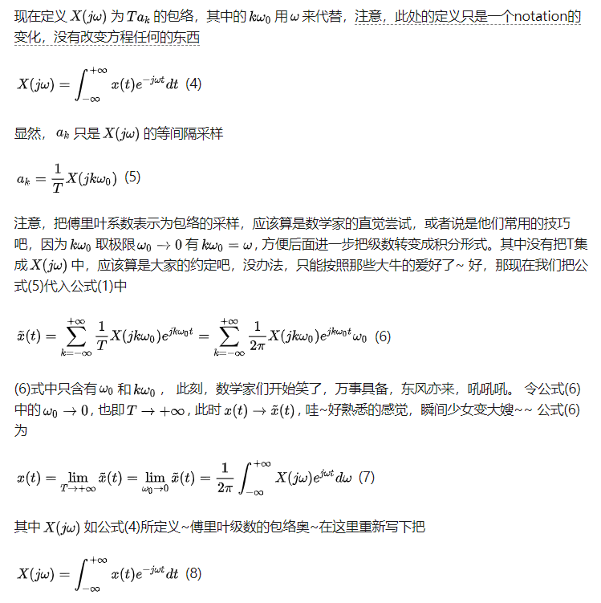
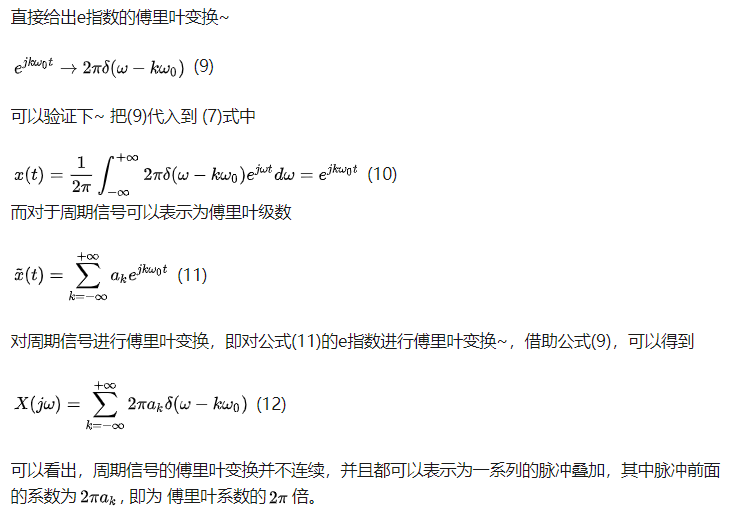

#### 欧拉公式

$$
e^{i\theta}=isin(\theta)+cos(\theta)
$$

#### 傅里叶级数

**适合于周期信号**

对于一组函数$e^{i2\pi fnt}$，其中：$n=0,\pm 1,\pm 2,...$，他们的周期都能被$e^{i2\pi ft}$（注意函数里的n没有了）的周期$T=1/f$整除（T是最小周期）

上面这组函数由两个特性，

1）只有n值互为相反数的两个函数在$(-T/2, T/2)$上的积分值为T，其他函数的积分都为0：
$$
\int_{-r/2}^{r/2}e^{i2\pi mft}e^{i2\pi nft}dt=T,when:m+n=0
$$

（因为抵消了）其他函数积分值为0？？

2）任何周期为T的函数都可以用这组函数线性表示
$$
h(t) = \sum_{n=-\infty}^{+\infty}A_ne^{i2\pi nft}
$$

An是**复系数**，根据上式；
$$
A_n = \frac{1}{T}\int_{-r/2}^{r/2}h(t)e^{i2\pi nft}$dt
$$

(3)被称为周期为T的函数h(t)的傅里叶级数展开，（4）为展开的系数

#### 非周期信号

公式中f不存在了，或者无穷小（周期无穷大）

这两种信号的区别在于一个是有固定的基频，另外一个基频无穷小。而无限小的求和概念不就对应着积分，周期T为∞大

如果非周期函数定义在一个有bai限区间[a,b)上，可以延拓成周期du函数后展开。常见的例子是zhif(x)=x, x属于[-π, π) 的Fourier展开。
如果dao是非周期函数是定义在全体实数集上的，无法展开成Fourier级数，后者是周期函数。此时，Fourier展开的替代品是Fourier变换，它把函数f(x)变成另一个函数g(x)=∫(-∝;+∝) f(t)exp(-ixt)dt. Fourier变换可以看作Fourier级数在周期->0时的极限

#### 导出傅里叶变换

#### 两者关系

周期信号可以由傅里叶级数表示，即e指数的求和形式；那么周期信号的傅里叶变换的关键不就在于e指数的傅里叶变换嘛~

当

参考：

傅里叶级数和傅里叶变换是什么关系？ - Jason Huang的回答 - 知乎 https://www.zhihu.com/question/21665935/answer/49282739

傅里叶级数和傅里叶变换 - 木不shi丁的文章 - 知乎 https://zhuanlan.zhihu.com/p/32341301