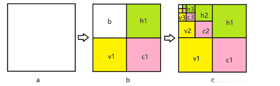
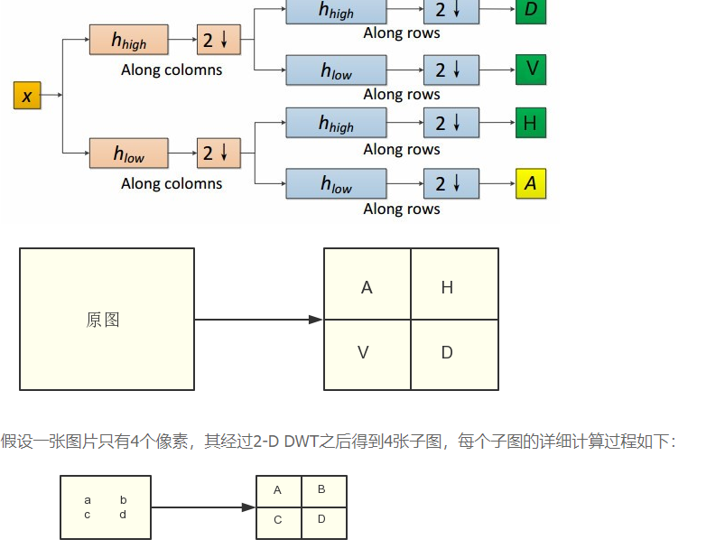

### 1. 二维图像变换

从水平和竖直两个方向进行低通和高通滤波（水平和竖直先后不影响），用图像表述如下图所示：图a表示原图，图b表示经过一级小波变换的结果，h1 表示水平反向的细节，v1 表示竖直方向的细节，c1表示对角线方向的细节，b表示下2采样的图像。图c中表示继续进行Haar小波变换。

### 2. 二维离散小波变换

A是低频信息，H是水平高频信息，V是垂直高频信息、D是对角高频信息

- `a` - LL, low-low coefficients
- `h` - LH, low-high coefficients
- `v` - HL, high-low coefficients
- `d` - HH, high-high coefficients

参考：[离散小波变换——二维，图像 - 豌豆ip代理 (wandouip.com)](https://www.wandouip.com/t5i207953/)