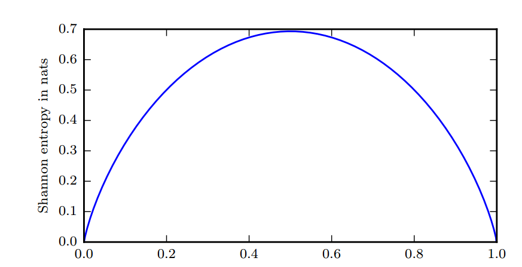
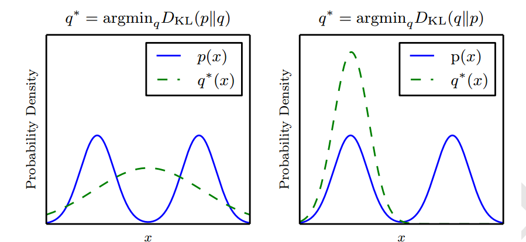
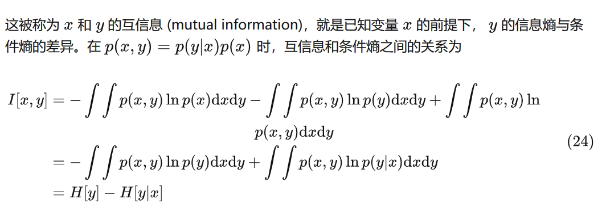

## 熵（Entropy）

定义：用于度量信息

热力学：用熵值描述系统混乱程度，这种混乱程度或无序性就代表了我们对系统的未知或不确定程度。

机器学习中，最小化误差函数，就是一个熵减的过程，此时误差函数就是熵的一种描述

这种不确定性往往反映着我们已掌握的信息量

### 信息熵

信息量就是不确定性的大小

- 比如我们知道一件事情发生的概率很小，但此时有人告知我们这件事情要发生，我们将获得大量信息；
- 如果已知一件事情很有可能发生，此时有人告诉我们这件事发生了，这时我们所获取的信息量相比前者就会小很多

考虑一个随机变量$x$ ，我们对信息内容的度量依赖概率分布 $p(x)$ ，然后寻找⼀个函数$h(x)$，它是概率 $p(x)$的单调递增函数，根据我们已知的概率大小表达信息量。

$h(x)$可以这样定义：对于不相关的两件事$a$和$b$，我们观察到两个事件同时发生时 获得的信息应该为这两个事件独立发生时获得的信息之和，即：

$$h(a,b)=h(a)+h(b)$$。

两个信息是独立统计的，其同时发生的概率为：

$$p(a,b)=p(a)p(b)$$，

据此，可以构造出$h(x)$于$p(x)$的关系
$$
\begin{equation}
I(x)= -log_2 p(x)
\end{equation}
$$
负号确保了信息的非负特性。

根据上式，$p(x)$越小，$I(x)$越大，即低概率事件对应于高信息量；

$I(x)$的单位是比特（bit，binary digit）。

对整个概率分布中不确定性总量进行量化可以用`香农熵`:
$$
H(x) = \mathbb{E}_{x\sim p}[I(x)] = -\mathbb{E}_{x\sim p}[log_2 p(x)]
$$
也记作$H(p)$​。现在假设⼀个发送者想传输⼀个随机的离散变量 $x$ 给接收者，离散变量概率分布为$p(x)$ 。此时传输的平均信息量通通过公式 (1) 关于$p(x)$的期望得到，期望值为
$$
H[x] = -\sum p(x)log_2 p(x)
$$
它给出了对依据概率分布$p(x)$生成的符号进行编码所需的比特数在平均意义上的`下界` 。那些接近确定性的分布 (输出几乎可以确定) 具有较低的熵；那些接近均匀分布的概率分布具有较高的熵 

当$x$是连续的，香农熵也被称为`微分熵`(differential entropy)。

 

上图中，横轴为$p$，熵由$(p-1)\log(1-p)-p\log p$给出。

比如说，我们想知道一篇 500 字的作文信息熵是多少，首先我们知道，这篇作文是由一些常用汉字组成的，如果常用汉字有 7000 个，**且每一个汉字出现概率相同**，那么根据公式 (2) 信息熵为 17000×log2⁡17000×500≈6500bit 。但实际上汉字出现概率不等

这就相当于引入先验知识，这种情况这篇文章包含的信息小于 6500bit 。到这我们又可以发现，引入先验知识后信息熵总会下降，而公式 (2) 取最大值的时候恰好也是每一个结果都等概率出现的时候。此时就是不确定性最高的时候。

## 熵的物理意义

## 相对熵(KL散度)

相对熵最早用在信号处理上，如果两个随机信号的相对熵越小，说明两个信号越接近，否则信号差异越大。如果用来处理某一事件的信息，相对熵用来衡量两个概率分布函数的相似性，相对熵越大，两个随机分布的差异越大，反之越小。考虑某个未知的分布 $p(x)$，以及使⽤某个分布$q(x)$ 对它进⾏近似。如果我们使⽤$q(x)$表示信息，由于不是真实分布，我们就需要⼀些附加的信息，这部分信息就是用来度量两个分布的平均信息差，也被称为分布  $p(x)$ 和之间的相对熵或 Kullback-Leibler 散度（KL散度），为

$$
KL(p||q) = -\mathbb{E}_{x\sim p}[\log_2 \frac{p(x)}{q(x)}] = -\mathbb{E}_{x\sim p}[\log_2 p(x)-\log_2 q(x)]
$$

KL 散度有很多有用的性质，最重要的是它是非负的。 KL 散度为 0 当且仅当 $p$ 和 $q$ 在离散型变量的情况下是相同的分布，或者在连续型变量的情况下是"几乎处处"相同的。因为 KL 散度是非负的并且衡量的是两个分布之间的差异，它经常被用作分布之间的某种距离。然而，它并不是真的距离因为它**不是对称**的：对于某些 $p$ 和 $q$， $KL(p||q)\ne KL(q||p)$。这种非对称性意味着选择 $KL(p||q)$还是 $KL(q||p)$ 影响很大。

左图为最小化$KL(p||q)$，右图为最小化$KL(q||p)$，

#### 交叉熵

定义：
$$
H(p,q) = H(p)+KL(p||q)\\
H(p,q) = -\mathbb{E}_{x\sim p}[\log_2 q(x)]
$$
对比KL散度，缺少左边一项（$\log_2 p(x)$），针对$q$最小化交叉熵等价于最小化 KL 散度，因为$q$并不参与被省略的那一项。

我们经常会遇到$0\log 0$这个表达式，按照惯例，一般处理为$\lim_{x\rightarrow 0}x\log x=0$。

## 互信息

现在考虑由联合概率分布  $p(x,y)$ 给出的两个随机变量 $x$ 和 $y$ 组成的数据集，如果两个变量是相互独⽴的，那么联合分布可以分解为边缘分布的乘积  $p(x,y)=p(x)p(y)$  。如果变量不完全独⽴，我们也可以通过考察联合概率分布与边缘概率分布乘积之间的 KL 散度来判断它们是否近似于相互独⽴。此时，KL 散度为

参考：

[信息论 Information Theory: 信息熵，熵的物理意义，相对熵，互信息 - PRML - 知乎 (zhihu.com)](https://zhuanlan.zhihu.com/p/370542880)