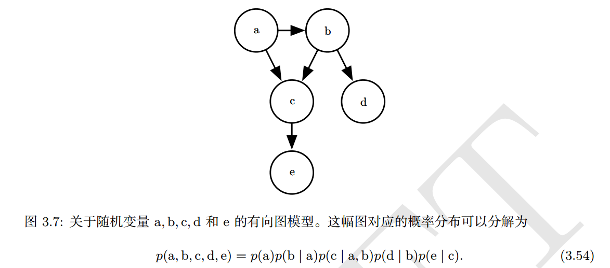

机器学习的算法经常会涉及到在非常多的随机变量上的概率分布。通常，这些概率分布涉及到的直接相互作用都是介于非常少的变量之间的。使用单个函数来描述整个联合概率分布是非常低效的 (无论是计算上还是统计上）。因此可以把概率分布分解成许多因子的乘积形式（而不是使用单一的函数来表示概率分布）。

例如，假定由三个随机变量$a,b,c$，其中，$a$ 会影响 $b$ 的取值，$b$ 会影响 $c$ 的取值，但是 $a$ 和 $c$ 在给定 $b$ 时是条件独立的。此时可以把三个变量的概率分布重新表示为两个变量的概率分布的连乘形式
$$
p(a,b,c)=p(a)p(b|a)p(c|b)
$$
**这种分解可以极大地减少用来描述一个分布的参数数量**。每个因子使用的参数数量时他的变量数量的指数倍（？）。这意味着如果找到一种使每个因子分布具有更少变量的分解方法，就可以极大地降低表示联合分布的成本。

当用图来表示这种概率分布的分解，我们把它称为`结构化概率模型`或者图模型。

参考：

《Deep Learning》花书 3.14节