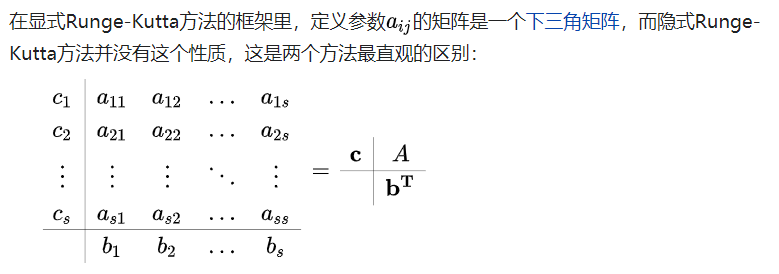

#### 1. Introduction

用于**[非线性常微分方程](https://zh.wikipedia.org/w/index.php?title=非线性常微分方程&action=edit&redlink=1)**的解的重要的一类隐式或显式迭代法

也可以用于非线性偏微分方程。

对于初值问题：
$$
\begin{cases}
        \frac{du}{dt}=f(t,u) \\
        u(t_0)=u
        \end{cases}
$$
写成积分形式（同时对（1）式左右两边积分）：
$$
u(t_n+h)=u(t_n)+\int_{t_n}^{t_n+h}f(t,u(t))dt
$$

由积分中值定理

$$
\int_{t_n}^{t_n+h}f(t,u(t))dt=hf(t_n+\theta h,u(t_n+\theta h)), 0<\theta<1
$$

可得：

$$
u(t_n+h)=u(t_n)+hf(t+\theta h,u(t_n+\theta h))
$$

但是中值无法计算，我们和f在位于$$(t_n,t_n+h)$$上的若干个点（如s个点）处的线性组合来近似他，并尽可能得到更高的精度。

#### 2. 常用形式

j经典四阶龙格-库塔法，称为RK4；

问题：

$$ y'=f(t,y); y(t_0)=y_0$$

2.1 由显式RK4得到：

$$ y_{n+1}=y_n+\frac{h}{6}(k_1+2k_2+2k_3+k_4)$$

$$k_1=f(t_n,y_n)$$

$$k_2=f(t_n+\frac{h}{2},y_n+\frac{h}{2}k_1)$$

$$k_3=f(t_n+\frac{h}{2},y_n+\frac{h}{2}k_2)$$

$$k_4=f(t_n+h,y_n+hk_3)$$

这意味着：下一个值（$y_{n+1}$）由现在的值（$y_n$）加上时间间隔/步长（*h*）和一个估算的斜率的乘积所决定。

- *k*1是时间段开始时的斜率；

- *k*2是时间段中点的斜率，通过[欧拉法](https://zh.wikipedia.org/wiki/欧拉法)采用斜率*k*1来决定*y*在点*t**n* + *h*/2的值；

- *k*3也是中点的斜率，但是这次采用斜率*k*2决定*y*值；

- *k*4是时间段终点的斜率，其*y*值用*k*3决定。

2.2 隐式RK

$$y_{n+1}=y_n+\sum_{i=1}^{8}b_ik_i$$

$$k_i=f(t_n+c_ih,y_n+h\sum^8_{j=1}a_{ij}k_j), i=1,2,3...s$$

$$b_i,c_i$$是助机工具。

#### 3. 级数与阶数

阶数即为截断误差$$u_{t_n+1}-u_{t_n}$$为$$O(h^n)$$，对于2阶RK，截断误差为$$O(h^3)$$

通用形式：
$$
\begin{cases}
        u_{n+1}=u_n+h\sum_{i=1}^s c_ik_i \\
        k_1=f(t_n,u_n) \\
        k_i=f(t_n+h\alpha_i.u_n+h\sum_{j=1}^{i-1}\beta_{ij}k_i); i=2,...s)
        \end{cases}
$$

公式(5)被称为`s`级RK方法，适当选取系数$$\alpha_i,\beta_{ij}$$可以使RK方法的局部截断误差具有尽可能高的阶`q`，q与s相关，$$q(s)$$；

s与q有以下关系：、
$$
\begin{cases}       
	q(s)=s, s=2,3,4 \\
	q(s)=s-1, s=5,6,7 \\
	q(s)=s-n, s>7
\end{cases}
$$
随着s增加，q增加变得缓慢。

这是显示龙格-库塔法的精度

隐式的可能为：
$$
q(s)=2s
$$

参考：[龙格库塔-wikipedia]([https://zh.wikipedia.org/wiki/%E9%BE%99%E6%A0%BC%EF%BC%8D%E5%BA%93%E5%A1%94%E6%B3%95](https://zh.wikipedia.org/wiki/龙格－库塔法))

