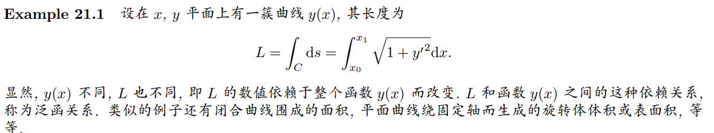
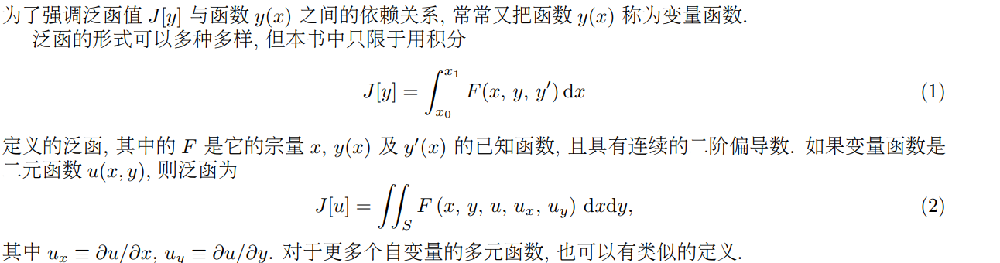
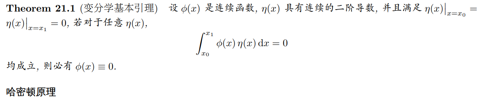
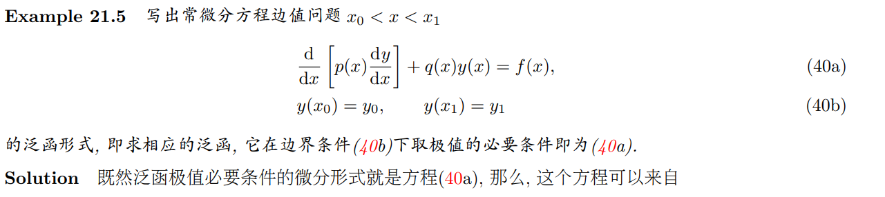
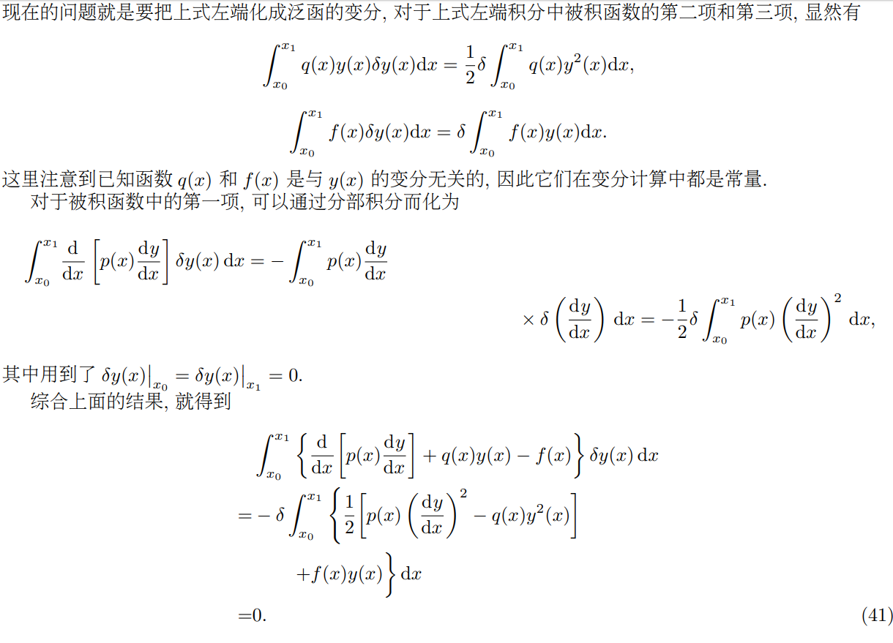
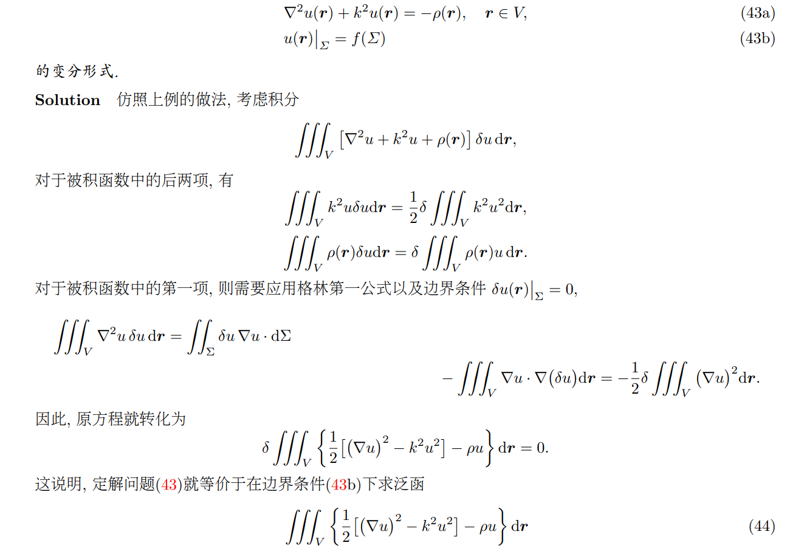
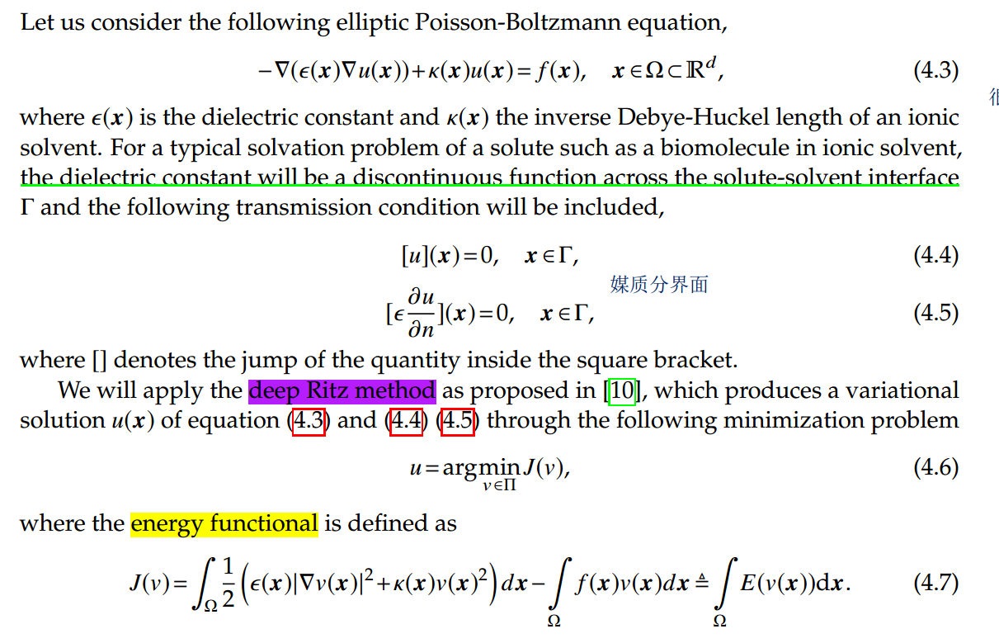
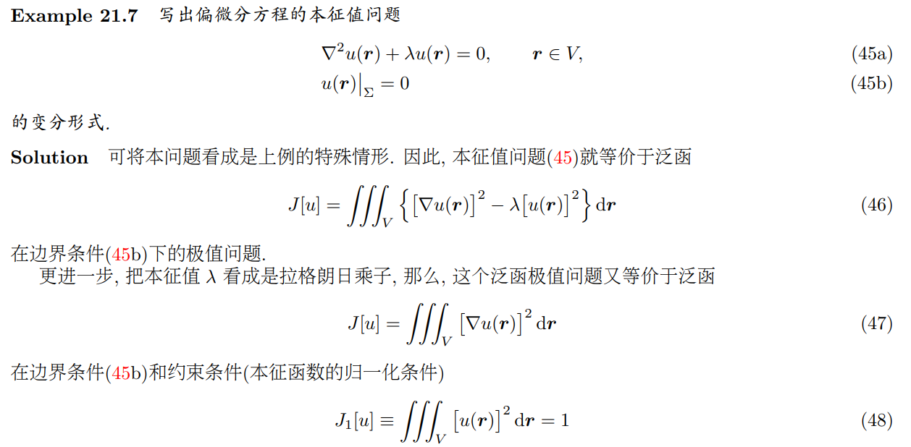
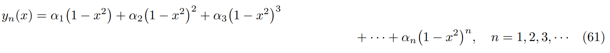

#### 1. 泛函的概念

泛函与复合函数不同，对复合函数g(f(x))来说，给定一个x，仍然有一个g与之对应。

泛函则必须给出某一区间上的函数y(x)，才能得到一个泛函值J[y]。**定义在同一区间上的函数值不同，泛函值当然不同。**

#### 2. 泛函极值

泛函 J[y] 取极小值的必要条件是泛函的一级变分为0，可以得到

#### 2.2 条件极值

#### 3. 二元情形

### 4. 微分方程转化为变分问题

#### 4.1 example 1

$$ \int^{x_1}_{x_0}\{\frac{d}{dx}[p(x)\frac{dy}{dx}] + q(x)y(x)-f(x) \}\delta y(x)dx=0$$

说明，方程(40a)是泛函

$$
J[y]=\int^{x_1}_{x_0}\{ \frac{1}{2} [p(x)(\frac{dy}{dx})^2-q(x)y^2(x)]+f(x)y(x)\}dx
$$
取得极值的必要条件。

#### 4.2 example 2

#### 4.3 Sturm-Liouville 本征值问题

#### 5 瑞利-里兹方法

用瑞利-里兹方法近似求解本征值问题的基本思路是: 

• 首先把**本征值问题**转化为泛函的条件极值问题 

• 然后缩小函数的范围, 用试探函数将泛函的条件极值问题转化为确定试探函数的参数的函数的条件极 值问题. 

从实用的角度看, 要选择一个**“好”的试探函数形式**, 一方面便于计算, 一方面又能够足够快地、足够精 确地求得本征值的近似值

使用的本征函数：既要满足边界条件，还要具有奇偶性。如可用下列函数集：

这种选择可以保证近似解在 x = 0 处没有 “尖点”,

$$(\frac{dy_n}{dx})_{x=0}=0$$

## 附录

#### 本征值

https://www.zhihu.com/question/52992219

参考：https://astrojacobli.github.io/Homepage/doc/Mathematical_Method/chpp21.pdf