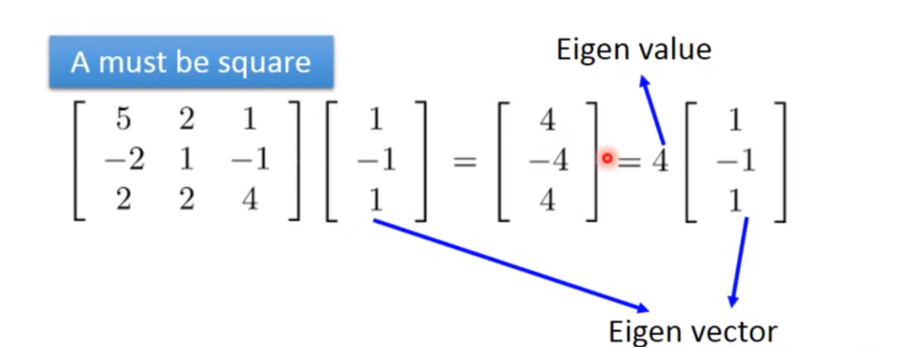
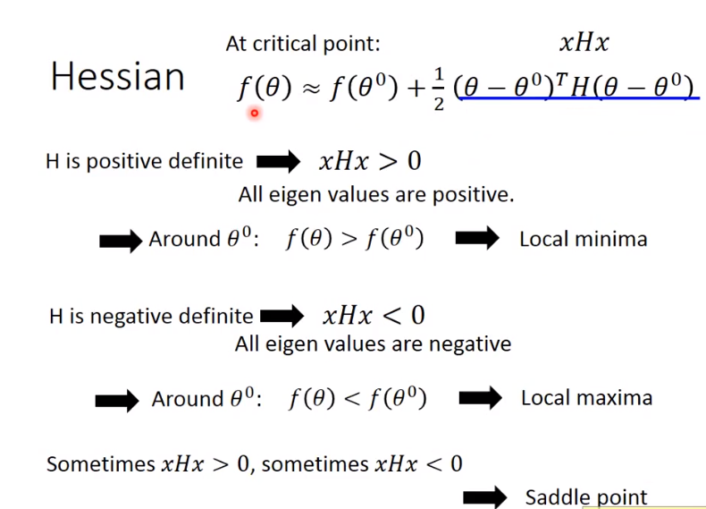
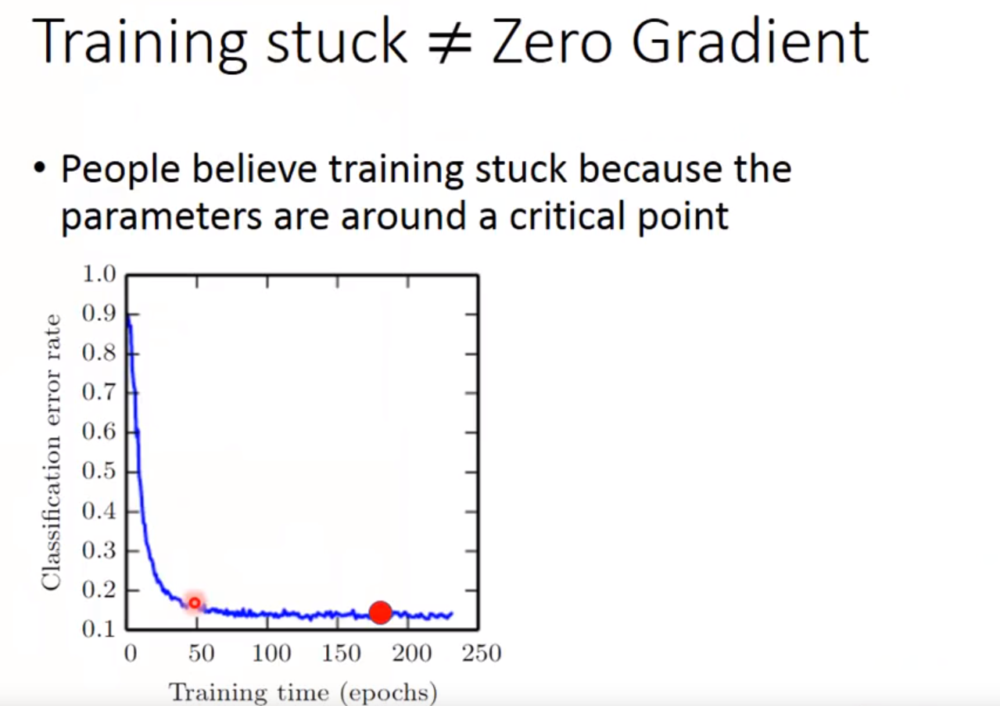

### 1. Hessian矩阵

用泰勒展开对loss函数展开：第一项为常量、第二项为一次导数、第三项为二次导数（偏微分中组成hessian矩阵。

如果一次导数为0，那么$f(\theta)$由hessian决定；

一次导数为0有如下三种情况；极大值位置、极小值位置、鞍点（saddle point）

### 2. 特征向量与特征值

#### 2.1 正定矩阵

一个*n*×*n*的实[对称矩阵](https://zh.wikipedia.org/wiki/對稱矩陣)**{\displaystyle M}**是**正定**的，[当且仅当](https://zh.wikipedia.org/wiki/当且仅当)对于所有的非零实系数[向量](https://zh.wikipedia.org/wiki/向量)*z*，都有$z^TMz > 0$。其中*z*T表示*z*的[转置](https://zh.wikipedia.org/wiki/轉置)，z是非零的。

### 3. 极值

当$xHx\le 0$；那么$f(\theta)$与$f(\theta……0)$的关系由后面的$O(\theta^3)$项决定

### 4. 海塞矩阵特征值

 

**Hessian**矩阵的特征值就是复形容其在该点附近特征向量方向的凹凸性，特征值越大，凸性越强，它控制着步长。

   ### 局部最小都是全局最小？？