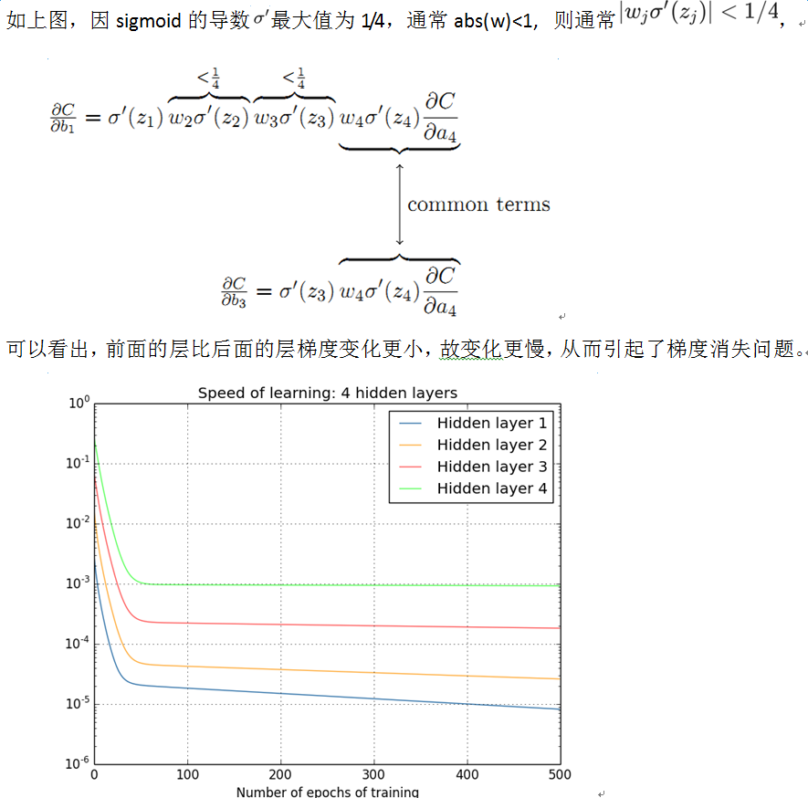
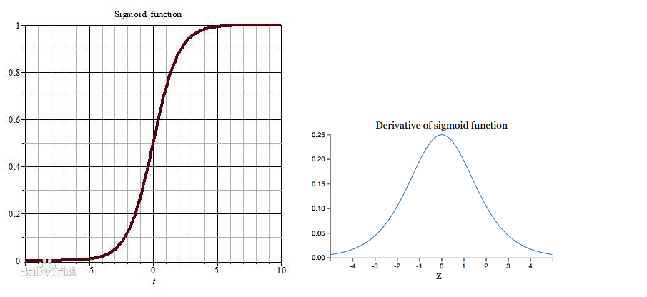

由于反向传播的连乘效应，前面层的梯度变化更小，变化更慢，这就是梯度消失问题。

### 激活函数的原因

#### sigmoid

如果使用sigmoid作为损失函数，其梯度是不可能超过0.25的，这样经过链式求导之后，很容易发生梯度消失，sigmoid函数数学表达式为：$sigmoid(x)=\frac{1}{1+e^{-x}}$

sigmoid函数形式与导数

#### Tanh

$$tanh(x)=\frac{e^x-e^{-x}}{e^x+e^{-x}}$$

## 解决方案

#### 1. 预训练+微调

#### 2. 梯度剪切+正则

#### 3. relu、elu等激活函数

#### 4 batchnorm

#### 5. 残差网络

