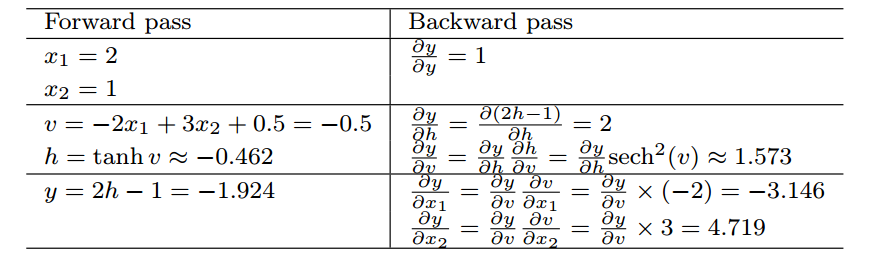

## automatic differential

### 四种微分方法

#### 1.1 手动求解

手动求解其实就对应我们传统的backprop算法，我们求解出梯度公式，然后编写代码，代入实际数值，得出真实的梯度。在这样的方式下，每一次我们修改算法模型，都要修改对应的梯度求解算法，因此没有很好的办法解脱用户手动编写梯度求解的代码，这也是为什么我们需要自动微分技术的原因。

#### 1.2 数值微分

比如有限差分

#### 1.3 符号微分

类似与matlab中符号微分方法，求出微分的形式，再带入求解。

### 1.4 自动微分

介于符号微分和数值微分的方法：将符号微分应用于基本的算子，比如：常熟、幂函数、指数函数等，然后代入数值，保留中间结果，最后再应用与整个函数。

实际上是一种图（graph）计算。？？

当输出的维度大于输入的时候，适宜使用前向模式微分；当输出维度远远小于输入的时候，适宜使用反向模式微分。

参考：[自动微分简介](https://blog.csdn.net/aws3217150/article/details/70214422)

### 举例说明

**当图的输出数目大于输入的数目时，有时更偏向于使用另外一种形式的自动微分**，称为 `前向模式累加`（forward mode accumulation）。前向模式计算已经被提出用于循环神经网络梯度的实时计算，例如 (Williams and Zipser, 1989)。这也避免了存储整个图的值和梯度的需要，是计算效率和内存使用的折中。前向模式和后向模式的关系类似于左乘和右乘一系列矩阵之间的关系，例  
$$
\boldsymbol{ABCD}
$$
其中的矩阵可以认为是 Jacobian 矩阵。例如，如果 D 是列向量，而 A 有很多行，那么这对应于一幅具有单个输出和多个输入的图，并且从最后开始乘，反向进行，只需要矩阵-向量的乘积。这对应着反向模式。相反，从左边开始乘将涉及一系列的矩阵-矩阵乘积，这使得总的计算变得更加昂贵。然而，如果 A 的行数小于 D 的列数，A则从左到右乘更为便宜，这对应着前向模    