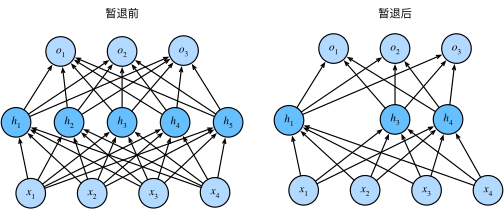

### 扰动的稳健性

经典泛化理论认为，为了缩小训练和测试性能之间的差距，应该以简单的模型为目标。

权重衰减（$L_2$ 正则化）时看到的那样， 参数的范数也代表了一种有用的简单性度量。

简单性的另一个角度是平滑性，即函数不应该对其输入的微小变化敏感。1995年，克里斯托弗·毕晓普证明了 具有输入噪声的训练等价于Tikhonov正则化 ([Bishop, 1995](https://zh.d2l.ai/chapter_references/zreferences.html#id9))。 这项工作用数学证实了“要求函数光滑”和“要求函数对输入的随机噪声具有适应性”之间的联系。

2014年，斯里瓦斯塔瓦等人 ([Srivastava *et al.*, 2014](https://zh.d2l.ai/chapter_references/zreferences.html#id155)) 就如何将毕晓普的想法应用于网络的内部层提出了一个想法： 在训练过程中，他们建议在计算后续层之前向网络的每一层注入噪声。 因为当训练一个有多层的深层网络时，注入噪声只会在输入-输出映射上增强平滑性。

这个想法被称为*暂退法*（dropout）。暂退法在前向传播过程中，计算每一内部层的同时注入噪声，这已经成为训练神经网络的常用技术。 这种方法之所以被称为*暂退法*，因为我们从表面上看是在训练过程中丢弃（drop out）一些神经元。 在整个训练过程的每一次迭代中，标准暂退法包括在计算下一层之前将当前层中的一些节点置零。

[4.6. 暂退法（Dropout） — 动手学深度学习 2.0.0 documentation (d2l.ai)](https://zh.d2l.ai/chapter_multilayer-perceptrons/dropout.html)