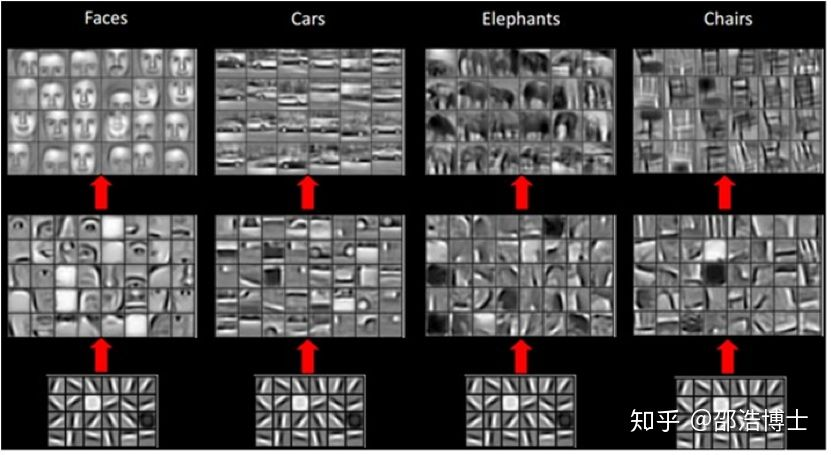

### 预训练

就是指预先训练的一个模型或者指预先训练模型的过程

找到一个相对较好的模型参数（比直接初始化更好）

对于层级的CNN结构来说，不同层学到的图像特征是不一样的，**越浅层所学到的特征越通用，越深层所学到的特征和具体任务关联性就越强**。在下图中，对于人脸、汽车、大象和椅子的任务而言，最浅层的通用特征“线条”都是一样的。因此，在大规模图片数据上预先获取“通用特征”，对下游任务会有非常大的帮助。

### 微调

指将预训练过的模型作用于自己的数据集，并使参数适应自己数据集的过程

在 CNN 领域中，实际上，很少人自己从头训练一个 CNN 网络。主要原因是自己很小的概率会拥有足够大的数据集，基本是几百或者几千张，不像 ImageNet 有 120 万张图片这样的规模。拥有的数据集不够大，而又想使用很好的模型的话，很容易会造成过拟合。
所以，一般的操作都是在一个大型的数据集上（ImageNet）训练一个模型，然后使用该模型作为类似任务的初始化或者特征提取器。比如 VGG，Inception 等模型都提供了自己的训练参数，以便人们可以拿来微调。这样既节省了时间和计算资源，又能很快的达到较好的效果。

参考：[预训练（pre-training/trained）和微调（fine-tuning） - 知乎 (zhihu.com)](https://zhuanlan.zhihu.com/p/389842883)

[请问深度学习中预训练模型是指什么？如何得到？ - 知乎 (zhihu.com)](https://www.zhihu.com/question/327642286)