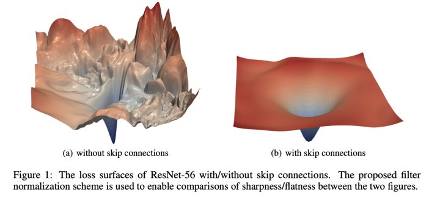
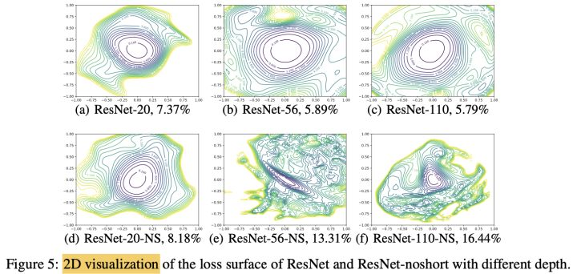
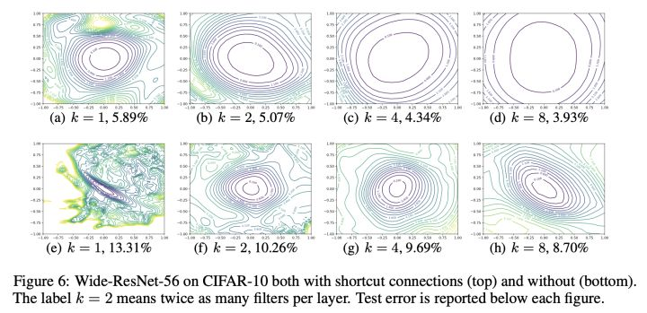

损失函数的优化

### 损失函数与学习率

loss 除以 C，学习率乘以 C，二者可以完全抵消，跟原来是等价的。

### 深度网络loss除以10和学习率除以10是不是等价的

- weight decay 不受loss尺度影响

- 取决于优化器

  - 对于带有二阶动量 $v_t$（即自适应学习率)的优化器，**如Adam，Adagrad，RMSprop等，**将loss乘以尺度 s，无影响，等价于学习率不变；

  - 对于其他优化器，**如SGD，Momentum SGD等**，将loss乘以尺度 s，等价于将学习率乘以尺度 s

参考：[深度网络loss除以10和学习率除以10是不是等价的？ - 知乎 (zhihu.com)](https://www.zhihu.com/question/320377013)

### 经验结论

#### skip connection网络更平滑，容易收敛

#### 更深的模型它的loss curvature/geometry 更 sharp

更不容易收敛到 local minimum，且loss geometry 的 flatness 在经验上跟模型的generalization ability 成正比：loss curvature 越平坦，模型越容易 generalization，在test set上的表现越好

#### 模型越宽，损失函数越flat

[神经网络如何设计自己的loss function，如果需要修改或设计自己的loss，需要遵循什么规则？ - 知乎 (zhihu.com)](https://www.zhihu.com/question/59797824)