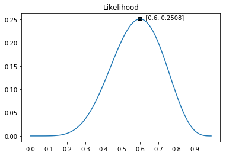

### 0. 介绍

定义：最大似然估计是机器学习中最常用的参数估计方法之一。整个建模过程需要一个似然函数来描述在不同模型参数下真实数据发生的概率，似然函数是关于**模型参数的函数**。最大似然估计就是寻找最优参数，使得观测数据发生的概率最大、统计模型与真实数据最相似。

在线性回归问题中，一般采用最小二乘法来选择最优参数以你和训练数据，即使用误差的平方作为损失函数。机器学习求解参数的过程成为参数估计，机器学习问题也变成求使损失函数最小的最优化问题。

最小二乘法比较直观，很容易解释，**但不具有普遍意义**，对于更多其他机器学习问题，比如二分类和多分类问题，最小二乘法就难以派上用场了。所以：**最大似然估计就是一个具有普遍意义的参数估计方法**。

### 1. 概率和似然

概率反映的是：**已知背后原因($\theta$)，推测某个结果发生的概率**。

与概率不同，似然反映的是：**已知结果，反推原因**。

似然（likelihood）函数表示的是基于观察的数据。取不同的参数$\theta$时，统计模型以多大的可能性接近真实观察数据。

似然函数与前面的概率函数的计算方式极其相似，与概率函数不同的是，似然函数是$\theta$的函数，即$\theta$是未知的

似然函数通常用$L$表示，对应英文Likelihood。观察到抛硬币“6正4反”的事实，硬币参数$\theta$取不同值时，似然函数表示为：
$$
L(\theta;6正4反)=C_10^6\times\theta^6\times(1-\theta)^4
$$
这个公式的图形如下图所示。从图中可以看出：参数$\theta$为0.6时，似然函数最大，参数为其他值时，“6正4反”发生的概率都相对更小。在这个赌局中，我会猜测下次硬币为正，因为根据已有观察，硬币很可能以0.6的概率为正。

推广到更为一般的场景，似然函数的一般形式可以用下面公式来表示，也就是之前提到的，各个样本发生的概率的乘积。
$$
L(\theta;\mathbf{X})=P_1(\theta;X_1)\times P_2(\theta;X_2)\times\dots\times P_n(\theta;X_n) = \prod P_i(\theta;X_i)
$$

### 2. 最大似然估计

似然函数是关于模型参数的函数，是描述观察到的真实数据在不同参数下发生的概率。最大似然估计要寻找最优参数，让似然函数最大化。或者说，使用最优参数时观测数据发生的概率最大。

#### 线性回归的最大似然估计

线性回归的误差项$\varepsilon$是预测值与真实值之间的差异，如下面公式所示。它可能是一些随机噪音，也可能是线性回归模型没考虑到的一些其他影响因素。
$$
y^{(i)}=\varepsilon^{(i)}+\sum^n_{j=1}w_ix_j^{(i)}=\varepsilon^{(i)}+\mathbf{w}^T \mathbf{x}^{(i)}
$$
假定误差项$\varepsilon$符合高斯分布
$$
p(x) = \frac{1}{\sqrt{2 \pi \sigma^2}} \exp\left(-\frac{1}{2 \sigma^2} (x - \mu)^2\right).
$$
where $\epsilon \sim \mathcal{N}(0, \sigma^2)$

因此，对于任意一个给定的 $x$ 其 $y$ 值得 likelihood为
$$
P(y \mid \mathbf{x}) = \frac{1}{\sqrt{2 \pi \sigma^2}} \exp\left(-\frac{1}{2 \sigma^2} (y - \mathbf{w}^\top \mathbf{x} - b)^2\right).
$$
 根据最大似然准则，参数 $w$ 得最佳值为最大化整个数据集上得likelihood
$$
P(\mathbf y \mid \mathbf X) = \prod_{i=1}^{n} p(y^{(i)} \mid \mathbf{x}^{(i)}).
$$
对于数据对 ($(\mathbf{x}^{(i)}, y^{(i)})$)，彼此相互独立，根据最大似然准则的估计被称为`最大似然估计`

可以用log变换获得更简单的形式，
$$
-\log P(\mathbf y \mid \mathbf X) = \sum_{i=1}^n \frac{1}{2} \log(2 \pi \sigma^2) + \frac{1}{2 \sigma^2} \left(y^{(i)} - \mathbf{w}^\top \mathbf{x}^{(i)} - b\right)^2.
$$
假定方差 $\sigma$ 是固定的，那么上式第一项可以去掉，第二项则与平方误差是一致的（不考虑前面乘的因子）。 It follows that minimizing the mean squared error is equivalent to maximum likelihood estimation of a linear model under the assumption of additive Gaussian noise.

#### 最小二乘与最大似然

前面的推导中发现，最小二乘与最大似然的公式几乎一样。直观上来说，最小二乘法是在寻找观测数据与回归超平面之间的误差距离最小的参数。最大似然估计是最大化观测数据发生的概率。当我们**假设误差是正态分布的**，所有误差项越接近均值0，概率越大。正态分布是在均值两侧对称的，误差项接近均值的过程等同于距离最小化的过程。

参考：

[最大似然估计 | 鲁老师 (lulaoshi.info)](https://lulaoshi.info/machine-learning/linear-model/maximum-likelihood-estimation.html)

[3.1. Linear Regression — Dive into Deep Learning 1.0.0-beta0 documentation (d2l.ai)](https://d2l.ai/chapter_linear-regression/linear-regression.html)