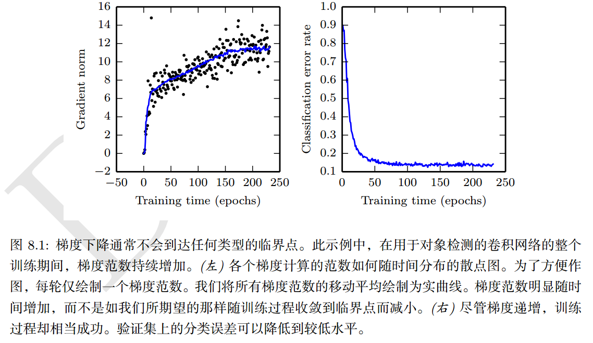

### 病态

最突出的是 Hessian 矩阵的病态，这是数值优化、凸优化或其他形式的优化中普遍存在的问题。

病态问题一般被认为存在于神经网络训练过程，病态体现在随机梯度下降会“卡”在某些情况，此时即使很小的更新步长也会增加代价函数。

代价函数的二阶泰勒展开，得到新的点 $\boldsymbol{x}^{(0)}-\epsilon\boldsymbol{g}$，处
$$
f(\boldsymbol{x}^{(0)}-\epsilon\boldsymbol{g}) = f(\boldsymbol{x}^{(0)}) -\epsilon\boldsymbol{g}^T\boldsymbol{g} + \frac{1}{2}\epsilon^2 \boldsymbol{g}^T\boldsymbol{H}\boldsymbol{g}
$$
预测梯度下降中的 $-\epsilon\boldsymbol{g}$ 会增加
$$
\frac{1}{2}\epsilon^2\boldsymbol{g}^T\boldsymbol{Hg}-\epsilon \boldsymbol{g}^T\boldsymbol{g}
$$
到代价中，当前一项超过后一项时，梯度的病态会成为问题。所以判断病态可以通过检测平方梯度范数  $\boldsymbol{g}^T\boldsymbol{g}$ 和$\boldsymbol{g}^T\boldsymbol{Hg}$。通常，平方梯度范数不会再训练中陷诸缩小，但是$\boldsymbol{g}^T\boldsymbol{Hg}$ 的增长会超过一个数量级。导致尽管梯度很强，但学习变得非常缓慢，因此学习率必须收缩以弥补更强的曲率。

### 局部极小值

凸优化：任何一个局部极小点都是全局最小点。有些凸函数的地步是一个平坦的区域，而不是全局最小点，但该平坦区域中任意点都是一个可接受的解。

对于非凸函数，如神经网络，可能会存在多个局部极小值。**但是这并不是主要问题**。

由于`模型可辨识性`(model identifiability)问题，神经网络和任意具有多个等效参数化潜变量（不能直接观测到的随机变量）的模型都会有多个局部极小值。如果一个足够大的训练集可以唯一确定一组模型参数，那么该模型被称为可辨认的。

带有潜变量的模型通常是不可辨认的，因为通过相互交换潜变量会得到等价的模型。如，对神经网络的第一层，交换单元 $i$ 和单元 $j$ 的传入权重向量、传出权重向量而得到等价的模型。如果神经网络由 $m$ 层，每层 $n$ 个单元，那么会有 $n!^m$ 中排列隐藏单元的方式。这种不可辨认性被称为`权重空间对称性`。

除了权重空间对称性，还有很多导致不可辨认的原因。比如再ReLU或Maxout网络中将传入权重和偏置扩大 $\alpha$倍，然后将传出权重扩大$\frac{1}{\alpha}$ ，而保持模型等价。

### 鞍点

牛顿法的目标是寻找梯度为零的点，如果没有适当修改，牛顿法就会跳进一个鞍点。高维空间中鞍点的激增或许解释了神经网络训练为什么二阶方法无法成功取代梯度下降法。

### 悬崖和梯度爆炸

使用启发式 `梯度截断`（gradient clipping）  。

### 长期依赖

当计算图变得极深时，神经网络优化算法会面临一个难题就是长期依赖——由于变身的结构使得模型丧失了学习到先前信息的能力，让优化变得极为困难。

### 非精确梯度

大多数优化算法的先决条件都是知道精确的梯度或是Hessian矩阵。

在实践中，通常这些量会有噪声，甚至是有偏的估计。几乎每一个深度学习算法都需要基于采样的估计，至少使用小批量训练样本来计算梯度

在其他情况，我们希望最小化的目标函数实际上是难以处理的。当目标函数不可解时，通常其梯度也是难以处理的。在这种情况下，我们只能近似梯度。这些问题主要出现在第三部分中更高级的模型中。例如， 对比散度是用来近似玻尔兹曼机中难以处理的对数似然梯度的一种技术。各种神经网络优化算法的设计都考虑到了梯度估计的缺陷。我们可以选择比真实损失函数更容易估计的代理损失函数来避免这个问题。  

### 局部和全局结构间的弱对应

