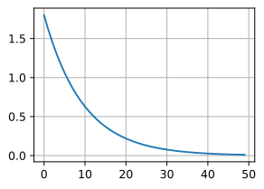
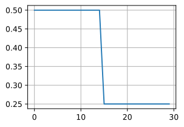
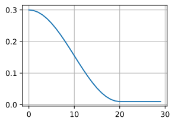
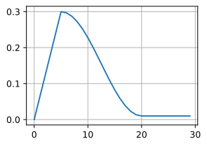

## 介绍

很久很久以前，在 Adam 和 Adagrad 发布之前，几乎所有神经网络的训练方式都是一样的 —— 使用一个固定的学习率和随机梯度下降（优化器）。

深度学习革命带来了一股新技术和新 idea 的旋风。在模型优化领域，最具影响力的两个新 idea 是`学习率调度器`（随时间修改学习率超参数，而不是保持不变）和`自适应优化器`（利用模型自身的反馈逼近梯度）。

### 学习率调度器

- 先，学习率的大小很重要。如果它太大，优化就会发散；如果它太小，训练就会需要过长时间，或者我们最终只能得到次优的结果。我们之前看到问题的条件数很重要（有关详细信息，请参见 [11.6节](https://zh.d2l.ai/chapter_optimization/momentum.html#sec-momentum)）。直观地说，这是最不敏感与最敏感方向的变化量的比率。
- 其次，衰减速率同样很重要。如果学习率持续过高，我们可能最终会在最小值附近弹跳，从而无法达到最优解。 [11.5节](https://zh.d2l.ai/chapter_optimization/minibatch-sgd.html#sec-minibatch-sgd)比较详细地讨论了这一点，在 [11.4节](https://zh.d2l.ai/chapter_optimization/sgd.html#sec-sgd)中我们则分析了性能保证。简而言之，我们希望速率衰减，但要比O(t−12)慢，这样能成为解决凸问题的不错选择。
- 另一个同样重要的方面是初始化。这既涉及参数最初的设置方式（详情请参阅 [4.8节](https://zh.d2l.ai/chapter_multilayer-perceptrons/numerical-stability-and-init.html#sec-numerical-stability)），又关系到它们最初的演变方式。这被戏称为*预热*（warmup），即我们最初开始向着解决方案迈进的速度有多快。一开始的大步可能没有好处，特别是因为最初的参数集是随机的。最初的更新方向可能也是毫无意义的。
- 最后，还有许多优化变体可以执行周期性学习率调整。这超出了本章的范围，我们建议读者阅读 [[Izmailov et al., 2018](https://zh.d2l.ai/chapter_references/zreferences.html#id76)]来了解个中细节。例如，如何通过对整个路径参数求平均值来获得更好的解。

### 策略

#### 单因子调度器

乘法衰减：$\eta_{t+1} \leftarrow \eta_t \cdot \alpha$

或者$\eta_{t+1} \leftarrow \mathop{\mathrm{max}}(\eta_{\mathrm{min}}, \eta_t \cdot \alpha)$

#### 多因子调度器

给定一组降低学习率的时间点，例$s = \{5, 10, 20\}$，当$t \in s$时，减低$\eta_{t+1} \leftarrow \eta_t \cdot \alpha$。

#### 余弦调度器

余弦调度器是 [[Loshchilov & Hutter, 2016](https://zh.d2l.ai/chapter_references/zreferences.html#id101)]提出的一种启发式算法。 它所依据的观点是：我们可能不想在一开始就太大地降低学习率，而且可能希望最终能用非常小的学习率来“改进”解决方案。 这产生了一个类似于余弦的调度，函数形式如下所示，学习率的值在t∈[0,T]之间
$$
\eta_t = \eta_T + \frac{\eta_0 - \eta_T}{2} \left(1 + \cos(\pi t/T)\right)
$$

#### 预热

在某些情况下，初始化参数不足以得到良好的解。 这对于某些高级网络设计来说尤其棘手，可能导致不稳定的优化结果。 对此，一方面，我们可以选择一个足够小的学习率， 从而防止一开始发散，然而这样进展太缓慢。 另一方面，较高的学习率最初就会导致发散。

解决这种困境的一个相当简单的解决方法是使用预热期，在此期间学习率将增加至初始最大值，然后冷却直到优化过程结束。 为了简单起见，通常使用线性递增。 这引出了如下表所示的时间表。

预热可以应用于任何调度器，而不仅仅是余弦。 有关学习率调度的更多实验和更详细讨论，请参阅 [[Gotmare et al., 2018](https://zh.d2l.ai/chapter_references/zreferences.html#id49)]。 其中，这篇论文的点睛之笔的发现：预热阶段限制了非常深的网络中参数的发散量。 这在直觉上是有道理的：在网络中那些一开始花费最多时间取得进展的部分，随机初始化会产生巨大的发散。

第一个著名的学习率调度器 `ReduceLROnPlateau` (Pytorch 中的 `torch.optim.lr_scheduler.ReduceLROnPlateau`)流行开来。`ReduceLROnPlateau` 需要一个`步长（step_size）`，一个耐心值（patience）和一个冷却期（cooldown）作为输入。在完成每一批次训练之后，检查模型性能是否有所提高。如果达到了耐心值批次时模型性能一直没有提高，那么学习率就会降低（通常是10倍）。在冷却期之后，这个过程再次重复，直到最后一批训练完成。

### 自适应优化器

自适应优化器避免使用单独的学习率调度器，而是选择将学习率优化直接嵌入到优化器本身。实际上，Adam 更进一步，根据每个权重来管理学习率。换句话说，它给了模型中的每个自由变量自己的学习率。Adam 实际分配给这个学习率的值是优化器本身的实现细节，而不是你可以直接操作的东西。

因为 Adam 在内部管理学习率，所以它与大多数学习率调度器不兼容。任何比简单的学习率预热（warmup）和/或衰减（decay）更复杂的操作都会使 Adam 优化器在管理其内部学习率 时“终结”学习率调度程序，导致模型收敛恶化。

### 结合使用

R表示热重启学习率调度器。

参考：[学习率调度器和自适应优化器简史 - 腾讯云开发者社区-腾讯云 (tencent.com)](https://cloud.tencent.com/developer/article/1815627)