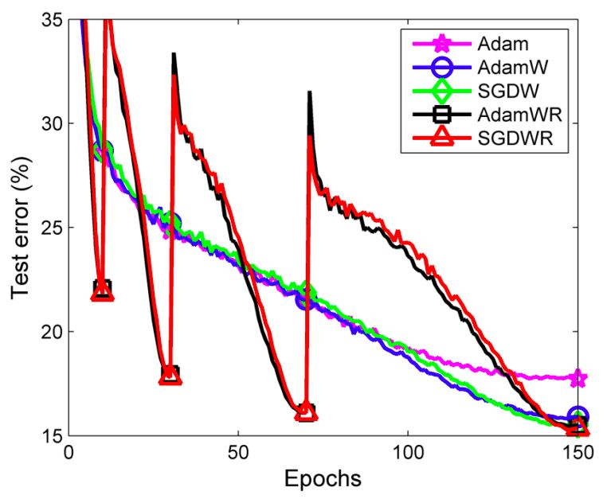

## 介绍

很久很久以前，在 Adam 和 Adagrad 发布之前，几乎所有神经网络的训练方式都是一样的 —— 使用一个固定的学习率和随机梯度下降（优化器）。

深度学习革命带来了一股新技术和新 idea 的旋风。在模型优化领域，最具影响力的两个新 idea 是`学习率调度器`（随时间修改学习率超参数，而不是保持不变）和`自适应优化器`（利用模型自身的反馈逼近梯度）。

### 学习率调度器

第一个著名的学习率调度器 `ReduceLROnPlateau` (Pytorch 中的 `torch.optim.lr_scheduler.ReduceLROnPlateau`)流行开来。`ReduceLROnPlateau` 需要一个`步长（step_size）`，一个耐心值（patience）和一个冷却期（cooldown）作为输入。在完成每一批次训练之后，检查模型性能是否有所提高。如果达到了耐心值批次时模型性能一直没有提高，那么学习率就会降低（通常是10倍）。在冷却期之后，这个过程再次重复，直到最后一批训练完成。

### 自适应优化器

自适应优化器避免使用单独的学习率调度器，而是选择将学习率优化直接嵌入到优化器本身。实际上，Adam 更进一步，根据每个权重来管理学习率。换句话说，它给了模型中的每个自由变量自己的学习率。Adam 实际分配给这个学习率的值是优化器本身的实现细节，而不是你可以直接操作的东西。

因为 Adam 在内部管理学习率，所以它与大多数学习率调度器不兼容。任何比简单的学习率预热（warmup）和/或衰减（decay）更复杂的操作都会使 Adam 优化器在管理其内部学习率 时“终结”学习率调度程序，导致模型收敛恶化。

### 结合使用

R表示热重启学习率调度器。

参考：[学习率调度器和自适应优化器简史 - 腾讯云开发者社区-腾讯云 (tencent.com)](https://cloud.tencent.com/developer/article/1815627)