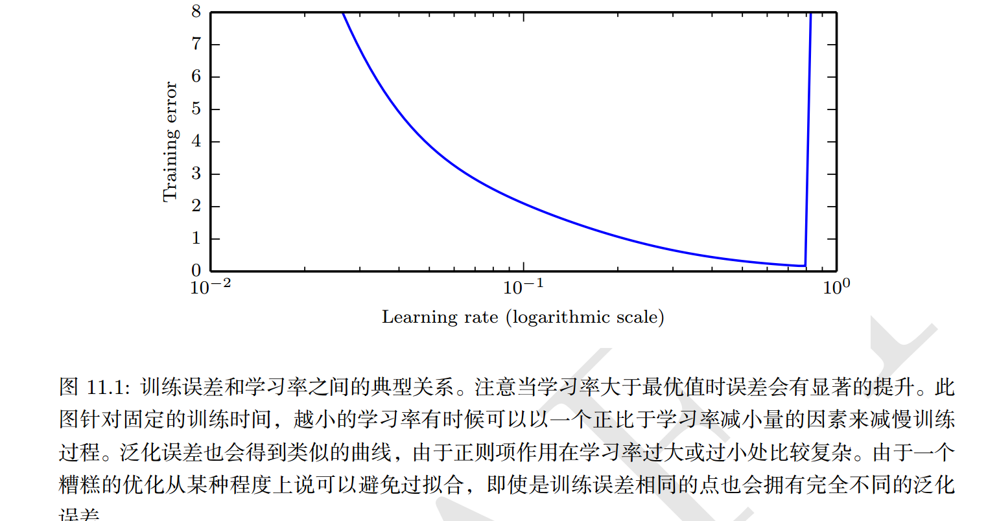

### 手动调整超参数

手动搜索超参数的主要目标是调整模型的有效容量以匹配任务的复杂性。  

有效容量受限于三个因素：

- 模型的表示容量、
- 学习算法成功最小化训练模型代价函数的能力
- 代价函数和训练过程正则化模型的程度  

学习率可能是最重要的超参数。如果你只有时间调整一个超参数，那就调整学习率。相比其他超参数，它以一种更复杂的方式控制模型的有效容量——当学习率适合优化问题时，模型的有效容量最高，此时学习率是正确的，既不是特别大也不是特别小。 学习率关于训练误差具有 U 形曲线，如图 11.1 所示。当学习率过大时， 梯度下降可能会不经意地增加而非减少训练误差。在理想化的二次情况下，如果学习率是最佳值的两倍大时，会发生这种情况 (LeCun et al., 1998a)。当学习率太小，训练不仅慢，还有可能永久停留在一个很高的训练误差。关于这种效应，我们知之甚少（不会发生于一个凸损失函数中） 

调整学习率外其他参数是，需要同时检测训练误差和测试误差，以判断模型是否过拟合或欠拟合。

如果训练集错误率过大，有必要增加更多网络层；

如果测试集错误率过大，可以改变正则化超参数

 

### 自动调整

理想的学习算法应该是只需要输入一个数据集，就可以输出学习的函数，而不需要手动调整超参数。一些流行的学习算法，如**逻辑回归和支持向量机**，流行的部分原因是这类算法只有一到两个超参数需要调整。 

原则上，可以开发出超参数优化算法，但遗憾的是这类算法往往由自己的超参数。

### 网格搜索

当有三个或更少的超参数时，常见的超参数搜索方法是 网格搜索（grid search）。对于每个超参数，使用者选择一个较小的有限值集去探索。然后，这些超参数笛卡尔乘积得到一组组超参数， 网格搜索使用每组超参数训练模型。挑选验证集误差最小的超参数作为最好的超参数。如图 11.2 所示超参数值的网络。  

通常， 网格搜索大约会在 对数尺度（logarithmic scale）下挑选合适的值，例如，一个学习率的取值集合是 {0.1, 0.01, $10^{-3}$, $10^{-4}$, $10^{-5}$}，或者隐藏单元数目的取值集合 {50; 100; 200; 500; 1000; 2000}。  

通常重复进行网格搜索时，效果会最好。例如，假设我们在集合 {-1; 0; 1} 上网格搜索超参数 $\alpha$。如果找到的最佳值是 1，那么说明我们低估了最优值 $\alpha$ 所在的范围。

### 随机搜索

随机搜索过程如下。首先，我们为每个超参数定义一个边缘分布，例如， Bernoulli分布或范畴分布（分别对应着二元超参数或离散超参数），或者对数尺度上的均匀分布。 

与网格搜索不同，我们不需要离散化超参数的值。这允许我们在一个更大的集合上进行搜索，而不产生额外的计算代价。实际上，如图 11.2 所示，当有几个超参数对性能度量没有显著影响时， 随机搜索相比于网格搜索指数级地高效。 Bergstra and Bengio (2012) 进行了详细的研究并发现相比于网格搜索， 随机搜索能够更快地减小验证集误差（就每个模型运行的试验数而言）  

随机搜索效果更好是因为网格搜索每次只改变一个超参数，而随机搜索改变很多值。

### 基于模型的超参数优化

简单的技巧：[寻找最佳学习率](./优化方法——1.4.寻找最佳学习率.md)

