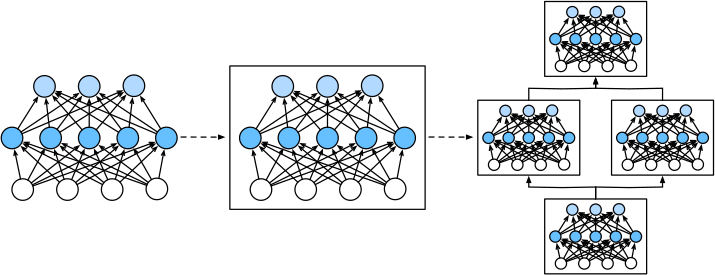

事实证明，研究讨论“比单个层大”但“比整个模型小”的组件更有价值。 例如，在计算机视觉中广泛流行的ResNet-152架构就有数百层， 这些层是由*层组*（groups of layers）的重复模式组成。 这个ResNet架构赢得了2015年ImageNet和COCO计算机视觉比赛 的识别和检测任务 [[He et al., 2016a](https://zh.d2l.ai/chapter_references/zreferences.html#id60)]。 目前ResNet架构仍然是许多视觉任务的首选架构。 在其他的领域，如自然语言处理和语音， 层组以各种重复模式排列的类似架构现在也是普遍存在。

为了实现这些复杂的网络，我们引入了神经网络*块*的概念。 *块*（block）可以描述单个层、由多个层组成的组件或整个模型本身。 使用块进行抽象的一个好处是可以将一些块组合成更大的组件， 这一过程通常是递归的，如 [图5.1.1](https://zh.d2l.ai/chapter_deep-learning-computation/model-construction.html#fig-blocks)所示。 通过定义代码来按需生成任意复杂度的块， 我们可以通过简洁的代码实现复杂的神经网络。

