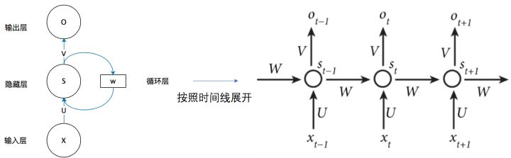

#### 简介

那么，现在我们来看看W是什么。**循环神经网络**的**隐藏层**的值s不仅仅取决于当前这次的输入x，还取决于上一次**隐藏层**的值s。**权重矩阵** W就是**隐藏层**上一次的值作为这一次的输入的权重

## 优化算法

#### LSTM-长短期记忆网络

RNN 是一种死板的逻辑，越晚的输入影响越大，越早的输入影响越小，且无法改变这个逻辑。

#### GRU

Gated Recurrent Unit – GRU 是 LSTM 的一个变体。他保留了 LSTM 划重点，遗忘不重要信息的特点，在long-term 传播的时候也不会被丢失

#### 价值

处理时序数据。