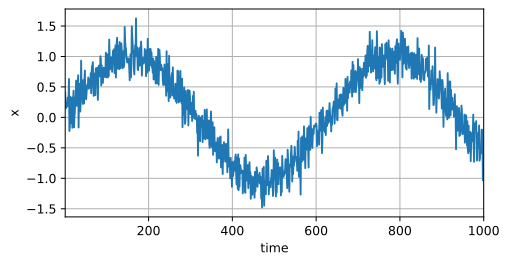
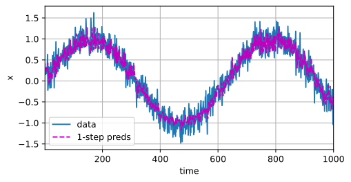
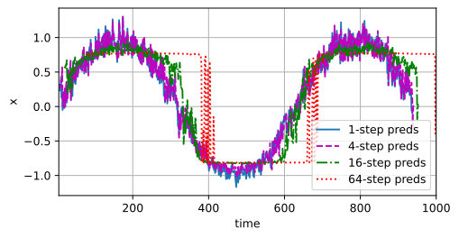

## 1. 序列模型

### 1.1 统计工具

其中，用 $x_t$ 表示价格，即在*时间步*（time step） $t \in \mathbb{Z}^+$ 时，观察到的价格 $x_t$ 。 请注意，$t$ 对于本文中的序列通常是离散的，并在整数或其子集上变化。 假设一个交易员想在 $t$ 日的股市中表现良好，于是通过以下途径预测 $x_t$：
$$
x_t \sim P(x_t \mid x_{t-1}, \ldots, x_1).
$$

#### 自回归模型

如何有效估计$P(x_t \mid x_{t-1}, \ldots, x_1)$，有以下两种策略

1. 不需要很长的序列，只需要某个长度为 $\tau$ 的是时间跨度，即使用观测序列 $x_{t-1}, \ldots, x_{t-\tau}$。好处是参数的数量总是不变的，至少在 $t > \tau$ 时如此，这样就可以训练一个深度网络，即`自回归模型`，因为他们是对自己执行回归
2. 保留一些对过去观测的总结 $h_t$，**同时更新**预测 $\hat{x}_t$ 和总结 $h_t$。得到基于 $\hat{x}_t = P(x_t \mid h_{t})$ 估计 $x_t$，以及公式 $h_t = g(h_{t-1}, x_{t-1})$ 更新的模型。由于 $h_t$ 从未被观测到，这类模型也被称为 *隐变量自回归模型*（latent autoregressive models）。

一个常见的假设是虽然特定值 $x_t$ 可能会改变， 但是序列本身的动力学不会改变。统计学家称不变的动力学为*静止的*（stationary）。 因此，整个序列的估计值都将通过以下的方式获得
$$
P(x_1, \ldots, x_T) = \prod_{t=1}^T P(x_t \mid x_{t-1}, \ldots, x_1).
$$
注意，如果我们处理的是离散的对象（如单词）， 而不是连续的数字，则上述的考虑仍然有效。 唯一的差别是，对于离散的对象， 我们需要使用分类器而不是回归模型来估计$P(x_t \mid x_{t-1}, \ldots, x_1)$

#### 马尔可夫模型

在自回归模型的近似法中， 我们使用 $x_{t-1}, \ldots, x_{t-\tau}$ 而不是 $x_{t-1}, \ldots, x_1$ 来估计 $x_t$。 只要这种是近似精确的，我们就说序列满足*马尔可夫条件*（Markov condition）。 特别是，如果$\tau=1$，得到一个 *一阶马尔可夫模型*（first-order Markov model）。

#### 因果关系

### 1.2 训练

对于如下数据

训练数据为前600步，然后 $\tau=4$，

单步预测：用前 $\tau$ 步预测1个结果（前600步是真实数据预测，后面400步是用预测的数据来预测）

k步预测：用前t步的数据预测 $t+k$ 处结果

