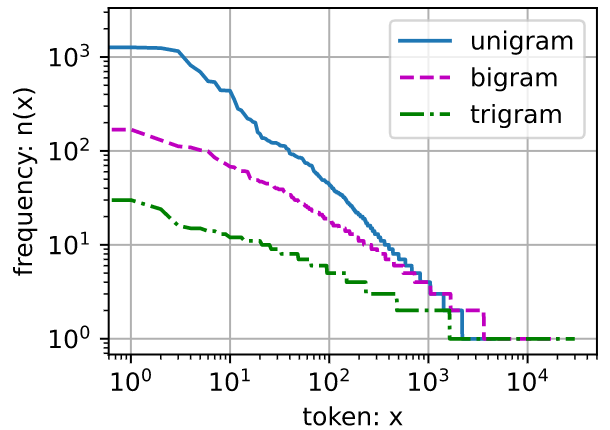

一个理想的语言模型就能够基于模型本身生成自然文本

### 学习语言模型

基本概率规则
$$
P(x_1, x_2, \ldots, x_T) = \prod_{t=1}^T P(x_t  \mid  x_1, \ldots, x_{t-1}).
$$
 例如，包含了四个单词的一个文本序列的概率是：
$$
P(\text{deep}, \text{learning}, \text{is}, \text{fun}) =  P(\text{deep}) P(\text{learning}  \mid  \text{deep}) P(\text{is}  \mid  \text{deep}, \text{learning}) P(\text{fun}  \mid  \text{deep}, \text{learning}, \text{is}).
$$
训练数据集中词的概率可以根据给定词的相对词频来计算。如，可以将估计值$\hat{P}$(deep) 计算为任何以单词“deep”开头的句子的概率。 一种（稍稍不太精确的）方法是统计单词“deep”在数据集中的出现次数， 然后将其除以整个语料库中的单词总数。 这种方法效果不错，特别是对于频繁出现的单词。 接下来，我们可以尝试估计
$$
\hat{P}(\text{learning} \mid \text{deep}) = \frac{n(\text{deep, learning})}{n(\text{deep})},
$$
其中 $n(x)$ 和 $n(x,x')$分别是单个单词和连续单词对出现次数。

特别是对于一些不常见的单词组合，要想找到足够的出现次数来获得准确的估计可能都不容易。

一种常见的策略是执行某种形式的`拉普拉斯平滑`，即在所有计数时加入一个小常量 $\epsilon$ 。用 $n$ 表示训练集中单词总数，用 $m$ 表示唯一单词的数量。该方案有助于处理单元素问题，如通过：
$$
\begin{split}\begin{aligned}
    \hat{P}(x) & = \frac{n(x) + \epsilon_1/m}{n + \epsilon_1}, \\
    \hat{P}(x' \mid x) & = \frac{n(x, x') + \epsilon_2 \hat{P}(x')}{n(x) + \epsilon_2}, \\
    \hat{P}(x'' \mid x,x') & = \frac{n(x, x',x'') + \epsilon_3 \hat{P}(x'')}{n(x, x') + \epsilon_3}.
\end{aligned}\end{split}
$$
当 $\epsilon_1=0$时，不应用平滑；当 $\epsilon_1\rightarrow \infty$，$\hat{P}(x)$ 接近均匀概率分布$\frac{1}{m}$。

这类模型过于简单而容易无效

### 马尔可夫模型与n元语法

如果序列山满足一阶马尔可夫性质，可以根据高阶关系，推导出许多应用于序列建模的近似公式：
$$
\begin{split}\begin{aligned}
P(x_1, x_2, x_3, x_4) &=  P(x_1) P(x_2) P(x_3) P(x_4),\\
P(x_1, x_2, x_3, x_4) &=  P(x_1) P(x_2  \mid  x_1) P(x_3  \mid  x_2) P(x_4  \mid  x_3),\\
P(x_1, x_2, x_3, x_4) &=  P(x_1) P(x_2  \mid  x_1) P(x_3  \mid  x_1, x_2) P(x_4  \mid  x_2, x_3).
\end{aligned}\end{split}
$$
通常，涉及一个、两个和三个变量的概率公式分别被称为 `一元语法`（unigram）、`二元语法`（bigram）和`三元语法`（trigram）模型。 下面，我们将学习如何去设计更好的模型

### 自然语言处理

绘制词元使用频率图，可以看到：词频衰减很快。最流行的往往是无意义的助词，`停用词`（stop words）。

这意味着单词频率满足齐`普夫定律`
$$
n_i\propto \frac{1}{i^\alpha} \Rightarrow \log n_i = -\alpha \log i +c
$$
这告诉我们想要通过计数统计和平滑来建模单词是不可行的， 因为这样建模的结果会大大高估尾部单词的频率，也就是所谓的不常用单词

其他多元语法的词频图

这张图非常令人振奋！原因有很多：

1. 除了一元语法词，单词序列似乎也遵循齐普夫定律， 尽管公式齐普夫定律中中的指数 $\alpha$ 更小 （指数的大小受序列长度的影响）；
2. 词表中n元组的数量并没有那么大，这说明语言中存在相当多的结构， 这些结构给了我们应用模型的希望；
3. 很多n元组很少出现，这使得拉普拉斯平滑非常不适合语言建模。 作为代替，我们将使用基于深度学习的模型。

### 读取长序列数据

当序列变得太长而不能被模型一次性全部处理时， 我们可能希望拆分这样的序列方便模型读取。

由于文本序列可以是任意长的，可以被划分为具有相同时间步数的子序列。

假设网络一次只处理具有 $n$ 个时间步的子序列。下图中 $n=5$ ，且每个时间步的词元对应于一个字符，且可以选择任意`偏移量`来指示初始位置

上图几种划分方式都一样很好。如果只选择一个偏移量，那么用于训练的子序列覆盖范围是有限的。因此我们可以从随机偏移量开始划分序列， 以同时获得`覆盖性`（coverage）和`随机性`（randomness）

#### 随机采样

在随机采样中，每个样本都是在原始的长序列上任意捕获的子序列。 在迭代过程中，来自两个相邻的、随机的、小批量中的子序列不一定在原始序列上相邻。 **对于语言建模，目标是基于到目前为止我们看到的词元来预测下一个词元， 因此标签是移位了一个词元的原始序列**。

#### 顺序分区

在迭代过程中，除了对原始序列可以随机抽样外， 我们还可以保证两个相邻的小批量中的子序列在原始序列上也是相邻的
