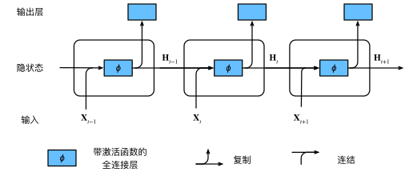
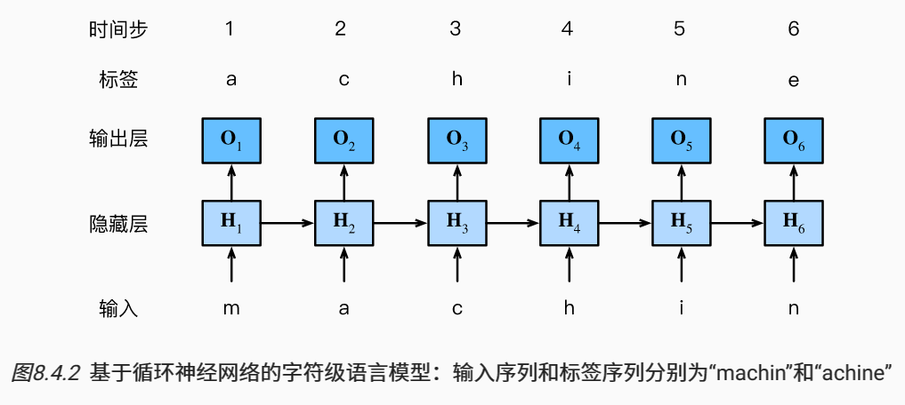

#### 隐变量模型

$$
P(x_t \mid x_{t-1}, \ldots, x_1) \approx P(x_t \mid h_{t-1}),
$$

其中 $h_{t-1}$ 是**隐状态**，也称为**隐藏变量**。。通常，基于当前输入 $x_t$ 和先前的隐状态 $h_{t-1}$ 来计算时间 $t$ 处任何时间的隐状态：
$$
h_t = f(x_{t}, h_{t-1}).
$$

### 无隐状态的神经网络

让我们来看一看只有单隐藏层的多层感知机。 设隐藏层的激活函数为 $\phi$， 给定一个小批量样本 $\bf{X}\in\mathbb{R}^{n\times d}$， 其中批量大小为 $n$，输入维度为 $d$， 则隐藏层的输出 $\bf{H}\in\mathbb{R}^{n\times h}$ 通过下式计算
$$
\mathbf{H} = \phi(\mathbf{X} \mathbf{W}_{xh} + \mathbf{b}_h).
$$
将隐藏变量 $\bf{H}$ 用作输出层的输入。 输出层由下式给出：
$$
\mathbf{O} = \mathbf{H} \mathbf{W}_{hq} + \mathbf{b}_q,
$$

### 有隐状态的循环神经网络

假设我们在时间步 $t$ 有小批量输入 $\bf{X}\in\mathbb{R}^{n\times d}$。 换言之，对于 $n$ 个序列样本的小批量，$\bf{X}_t$ 的每一行对应于来自该序列的时间步 $t$ 处的一个样本。 接下来，用 $\bf{H}_t\in\mathbb{R}^{n\times h}$ 表示时间步 $t$ 的隐藏变量。 与多层感知机不同的是， 我们在这里保存了前一个时间步的隐藏变量 $\bf{H}_{t-1}$， 并引入了一个新的权重参数 $\bf{W}_hh\in\mathbb{R}^{h\times h}$， 来描述如何在当前时间步中使用前一个时间步的隐藏变量。 具体地说，当前时间步隐藏变量由当前时间步的输入 与前一个时间步的隐藏变量一起计算得出：
$$
\mathbf{H}_t = \phi(\mathbf{X}_t \mathbf{W}_{xh} + \mathbf{H}_{t-1} \mathbf{W}_{hh}  + \mathbf{b}_h).
$$
与无隐状态的神经网络相比，多了一项 $\mathbf{H}_{t-1} \mathbf{W}_{hh}$。

由于在当前时间步中，隐状态使用的定义与前一个时间步中使用的定义相同， 因此上式的计算是`循环`的（recurrent）。 于是基于循环计算的隐状态神经网络被命名为`循环神经网络`（recurrent neural network）。 在循环神经网络中执行上式计算的层 称为*循环层*（recurrent layer）。

对于时间步 $t$，输出层的输出类似于多层感知机中的计算：
$$
\mathbf{O}_t = \mathbf{H}_t \mathbf{W}_{hq} + \mathbf{b}_q.
$$
**即使在不同的时间步，循环神经网络也总是使用这些模型参数。 因此，循环神经网络的参数开销不会随着时间步的增加而增加。**

### 基于循环神经网络的字符级语言模型

为了简化后续部分的训练，我们考虑使用 *字符级语言模型*（character-level language model）， **将文本词元化为字符而不是单词**。下图演示了 如何通过基于字符级语言建模的循环神经网络， 使用当前的和先前的字符预测下一个字符。

在实践中，我们使用的批量大小为$n>1$， 每个词元都由一个 $d$ 维向量表示。 因此，在时间步 $t$ 输入 $\bf{X}_t$ 将是一个 $n\times d$ 矩阵

### 困惑度（Perplexity）

 一个更好的语言模型应该能让我们更准确地预测下一个词元。 因此，它应该允许我们在压缩序列时花费更少的比特。 所以我们可以通过一个序列中所有的 $n$ 个词元的交叉熵损失的平均值来衡量：
$$
\frac{1}{n} \sum_{t=1}^n -\log P(x_t \mid x_{t-1}, \ldots, x_1),
$$
其中 $P$ 由语言模型给出， $x_t$ 是在时间步 $t$ 从该序列中观察到的实际词元。 这使得不同长度的文档的性能具有了可比性。 由于历史原因，自然语言处理的科学家更喜欢使用一个叫做*困惑度*（perplexity）的量。 简而言之，它是上式的指数：
$$
\exp\left(-\frac{1}{n} \sum_{t=1}^n \log P(x_t \mid x_{t-1}, \ldots, x_1)\right).
$$
困惑度可以理解为“下一个词元的实际选择数的调和平均数”。