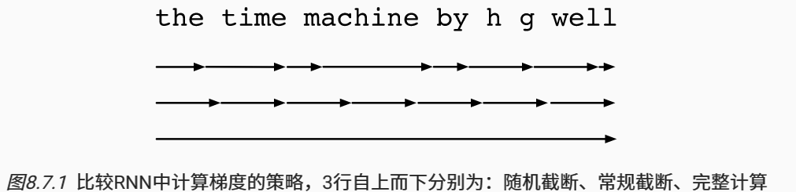
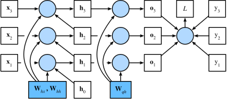

`通过时间反向传播`（backpropagation through time，BPTT） ([Werbos, 1990](https://zh.d2l.ai/chapter_references/zreferences.html#id182))实际上是循环神经网络中反向传播技术的一个特定应用。 它要求我们将循环神经网络的计算图**一次展开一个时间步**， 以获得模型变量和参数之间的依赖关系。 然后，基于链式法则，应用反向传播来计算和存储梯度。 由于序列可能相当长，因此依赖关系也可能相当长。 例如，某个1000个字符的序列， 其第一个词元可能会对最后位置的词元产生重大影响。 这在计算上是不可行的（它需要的时间和内存都太多了）， 并且还需要超过1000个矩阵的乘积才能得到非常难以捉摸的梯度。 这个过程充满了计算与统计的不确定性。 

### 梯度分析

忽略标量、向量和矩阵的符号区别。

我们分别使用 $w_h$ 和 $w_o$ 来表示隐藏层和输出层的权重。 每个时间步的隐状态和输出可以写为
$$
\begin{split}\begin{aligned}h_t &= f(x_t, h_{t-1}, w_h),\\o_t &= g(h_t, w_o),\end{aligned}\end{split}
$$
$f$ 和 $g$ 分别是隐藏层和输出层的变换。因此，有一个链 $\{\ldots, (x_{t-1}, h_{t-1}, o_{t-1}), (x_{t}, h_{t}, o_t), \ldots\}$ 通过循环计算彼此依赖。

`前向传播`：一次一个时间步地遍历三元组 $(x_t, h_t, o_t)$,通过一个目标函数在所有 $T$ 个时间步内 评估输出 $o_t$ 和对应的标签 $y_t$ 之间的差异
$$
L(x_1, \ldots, x_T, y_1, \ldots, y_T, w_h, w_o) = \frac{1}{T}\sum_{t=1}^T l(y_t, o_t).
$$
对于反向传播，按照链式法则：
$$
\begin{split}\begin{aligned}\frac{\partial L}{\partial w_h}  & = \frac{1}{T}\sum_{t=1}^T \frac{\partial l(y_t, o_t)}{\partial w_h}  \\& = \frac{1}{T}\sum_{t=1}^T \frac{\partial l(y_t, o_t)}{\partial o_t} \frac{\partial g(h_t, w_o)}{\partial h_t}  \frac{\partial h_t}{\partial w_h}.\end{aligned}\end{split}
$$
乘积的第一项和第二项很容易计算， 而第三项 $\frac{\partial h_t}{\partial w_h}$ 则出现问题
$$
\frac{\partial h_t}{\partial w_h}= \frac{\partial f(x_{t},h_{t-1},w_h)}{\partial w_h} +\frac{\partial f(x_{t},h_{t-1},w_h)}{\partial h_{t-1}} \frac{\partial h_{t-1}}{\partial w_h}.
$$
最终得到
$$
\frac{\partial h_t}{\partial w_h}=\frac{\partial f(x_{t},h_{t-1},w_h)}{\partial w_h}+\sum_{i=1}^{t-1}\left(\prod_{j=i+1}^{t} \frac{\partial f(x_{j},h_{j-1},w_h)}{\partial h_{j-1}} \right) \frac{\partial f(x_{i},h_{i-1},w_h)}{\partial w_h}.
$$

#### 完全计算

非常缓慢，并且可能会发生梯度爆炸， 因为初始条件的微小变化就可能会对结果产生巨大的影响

#### 截断时间步

在 $\tau$ 步后截断求和计算，这会带来真实梯度的*近似*， 只需将求和终止为$\partial h_{t-\tau}/\partial w_h$

#### 随机截断

我们可以用一个随机变量替换$\partial h_{t}/\partial w_h$，该随机变量在预期中是正确的，但是会截断序列。 这个随机变量是通过使用序列 $\xi_t$ 来实现的， 序列预定义了 $0≤\pi_t≤1$， 其中 $P(\xi_t = 0) = 1-\pi_t$ 且 $P(\xi_t = \pi_t^{-1}) = \pi_t$， 因此 $E[\xi_t] = 1$。 我们使用它得到
$$
z_t= \frac{\partial f(x_{t},h_{t-1},w_h)}{\partial w_h} +\xi_t \frac{\partial f(x_{t},h_{t-1},w_h)}{\partial h_{t-1}} \frac{\partial h_{t-1}}{\partial w_h}.
$$
从 $\xi_t$ 地定义中推导出来 $E[z_t] = \partial h_t/\partial w_h$。

每当 4\xi_t = 0￥ 时，递归计算终止在这个t时间步。 这导致了不同长度序列的加权和，其中长序列出现的很少， 所以将适当地加大权重。 这个想法是由塔莱克和奥利维尔 ([Tallec and Ollivier, 2017](https://zh.d2l.ai/chapter_references/zreferences.html#id164))提出的。

#### 比较策略

当基于循环神经网络使用通过时间反向传播 分析《时间机器》书中前几个字符的三种策略：

- 第一行采用随机截断，方法是将文本划分为不同长度的片断；
- 第二行采用常规截断，方法是将文本分解为相同长度的子序列。 这也是我们在循环神经网络实验中一直在做的；
- 第三行采用通过时间的完全反向传播，结果是产生了在计算上不可行的表达式。

遗憾的是，虽然随机截断在理论上具有吸引力， 但很可能是由于多种因素在**实践中并不比常规截断更好**。 首先，在对过去若干个时间步经过反向传播后， 观测结果足以捕获实际的依赖关系。 其次，增加的方差抵消了时间步数越多梯度越精确的事实。 第三，我们真正想要的是只有短范围交互的模型。 因此，模型需要的正是截断的通过时间反向传播方法所具备的轻度正则化效果。

### 更多细节

为了保持简单，我们考虑一个没有偏置参数的循环神经网络， 其在隐藏层中的激活函数使用恒等映射 ($\phi(x)=x$)
$$
\begin{split}\begin{aligned}\mathbf{h}_t &= \mathbf{W}_{hx} \mathbf{x}_t + \mathbf{W}_{hh} \mathbf{h}_{t-1},\\
\mathbf{o}_t &= \mathbf{W}_{qh} \mathbf{h}_{t},\end{aligned}\end{split}
$$
目标函数的总体损失是
$$
L = \frac{1}{T} \sum_{t=1}^T l(\mathbf{o}_t, y_t).
$$

在任意时间步 $t$， 目标函数关于模型输出的微分计算
$$
\frac{\partial L}{\partial \mathbf{o}_t} =  \frac{\partial l (\mathbf{o}_t, y_t)}{T \cdot \partial \mathbf{o}_t} \in \mathbb{R}^q.
$$
根据链式法则
$$
\frac{\partial L}{\partial \mathbf{W}_{qh}}
= \sum_{t=1}^T \text{prod}\left(\frac{\partial L}{\partial \mathbf{o}_t}, \frac{\partial \mathbf{o}_t}{\partial \mathbf{W}_{qh}}\right)
= \sum_{t=1}^T \frac{\partial L}{\partial \mathbf{o}_t} \mathbf{h}_t^\top,
$$
在最后的时间步 $T$，目标函数 $L$ 仅通过 $o_T$ 依赖于隐状态 $h_T$。 因此，我们通过使用链式法可以很容易地得到梯度 $\partial L/\partial \mathbf{h}_T \in \mathbb{R}^h$
$$
\frac{\partial L}{\partial \mathbf{h}_T} = \text{prod}\left(\frac{\partial L}{\partial \mathbf{o}_T}, \frac{\partial \mathbf{o}_T}{\partial \mathbf{h}_T} \right) = \mathbf{W}_{qh}^\top \frac{\partial L}{\partial \mathbf{o}_T}.
$$
隐状态的梯度 $\partial L/\partial \mathbf{h}_t \in \mathbb{R}^h$ 在任何时间步骤 $t < T$ 时都可以递归地计算为：
$$
\frac{\partial L}{\partial \mathbf{h}_t} = \text{prod}\left(\frac{\partial L}{\partial \mathbf{h}_{t+1}}, \frac{\partial \mathbf{h}_{t+1}}{\partial \mathbf{h}_t} \right) + \text{prod}\left(\frac{\partial L}{\partial \mathbf{o}_t}, \frac{\partial \mathbf{o}_t}{\partial \mathbf{h}_t} \right) = \mathbf{W}_{hh}^\top \frac{\partial L}{\partial \mathbf{h}_{t+1}} + \mathbf{W}_{qh}^\top \frac{\partial L}{\partial \mathbf{o}_t}.
$$
为了进行分析，对于任何时间步 $1 \leq t \leq T$ 展开递归计算得
$$
\frac{\partial L}{\partial \mathbf{h}_t}= \sum_{i=t}^T {\left(\mathbf{W}_{hh}^\top\right)}^{T-i} \mathbf{W}_{qh}^\top \frac{\partial L}{\partial \mathbf{o}_{T+t-i}}.
$$
这个简单的线性例子已经展现了长序列模型的一些关键问题： 它陷入到 $\mathbf{W}_{hh}^\top$ 的潜在的非常大的幂。 在这个幂中，小于1的特征值将会消失，大于1的特征值将会发散。 这在数值上是不稳定的，表现形式为梯度消失或梯度爆炸。 解决此问题的一种方法是按照计算方便的需要截断时间步长的尺寸