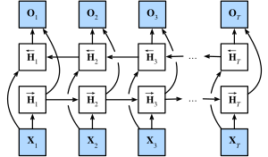

文字模型中，既要考虑上文，也需要考虑下文

### 隐马尔可夫模型中的动态规划

动态规划问题

设计一个隐变量模型： 在任意时间步 $t$，假设存在某个隐变量 $h_t$， 通过概率 $P(x_t \mid h_t)$ 控制我们观测到的 $x_t$。 此外，任何 $h_t \to h_{t+1}$ 转移 都是由一些状态转移概率 $P(h_{t+1} \mid h_{t})$ 给出。 这个概率图模型就是一个*隐马尔可夫模型*（hidden Markov model，HMM）

pass

### 双向模型

*双向循环神经网络*（bidirectional RNNs） 添加了反向传递信息的隐藏层，以便更灵活地处理此类信息。下图描述了具有单个隐藏层的双向循环神经网络的架构。

