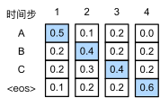
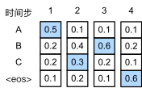
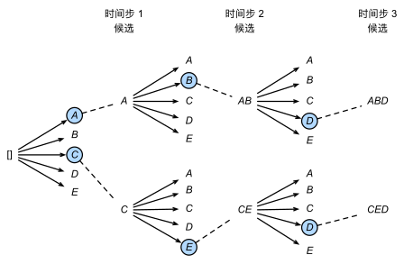

 在任意时间步 $t'$，解码器输出 $y_{t'}$ 的概率取决于时间步 $t′$之前的输出子序列 $y_1, \ldots, y_{t'-1}$ 和对输入序列的信息进行编码得到的上下文变量 $\mathbf{c}$。 为了量化计算代价，用 $\mathcal{Y}$ 表示输出此表，其中包含特定的序列结束词元“<eos>"，所以 词汇集合的基数 $\left|\mathcal{Y}\right|$ 就是词表的大小。将输出序列的最大词元数指定为 $T'$。 因此，我们的目标是从所有 $\mathcal{O}(\left|\mathcal{Y}\right|^{T'})$个 **可能的输出序列中寻找理想的输出**。 当然，对于所有输出序列，在“<eos>”之后的部分（非本句） 将在实际输出中丢弃。

### 贪心搜索

输出序列的每一时间步 $t'$， 我们都将基于贪心搜索从 $\mathcal{Y}$ 中找到具有最高条件概率的词元，即
$$
y_{t'} = \operatorname*{argmax}_{y \in \mathcal{Y}} P(y \mid y_1, \ldots, y_{t'-1}, \mathbf{c})
$$
一旦输出序列包含了“<eos>”或者达到其最大长度 $T'$，则输出完成。

如上图，假设输出中有四个词元“A”“B”“C”和“<eos>”。 每个时间步下的四个数字分别表示在该时间步 生成“A”“B”“C”和“<eos>”的条件概率。 在每个时间步，贪心搜索选择具有最高条件概率的词元。 因此，将预测输出序列“A”“B”“C”和“<eos>”。 这个输出序列的条件概率是 $0.5\times0.4\times0.4\times0.6 = 0.048$。

### 贪心搜索存在的问题

现实中，`最优序列`（optimal sequence）应该是最大化 $\prod_{t'=1}^{T'} P(y_{t'} \mid y_1, \ldots, y_{t'-1}, \mathbf{c})$ 值的输出序列，这是基于输入序列生成输出序列的条件概率。 然而，贪心搜索无法保证得到最优序列。

上图在时间步2中， 我们选择词元“C”， 它具有*第二*高的条件概率。 由于时间步3所基于的时间步1和2处的输出子序列已从 “A”和“B”改变为上图中的“A”和“C”， 因此时间步3处的每个词元的条件概率也在上图中改变。 假设我们在时间步3选择词元“B”， 于是当前的时间步4基于前三个时间步的输出子序列“A”“C”和“B”为条件， 这与 第一张图中的“A”“B”和“C”不同。 因此，在上图的时间步4生成 每个词元的条件概率也不同于 [图9.8.1](https://zh.d2l.ai/chapter_recurrent-modern/beam-search.html#fig-s2s-prob1)中的条件概率。 结果，输出序列 “A”“C”“B”和“<eos>”的条件概率为 0.5×0.3×0.6×0.6=0.054，

### 穷举搜索

穷举地列举所有可能的输出序列及其条件概率， 然后计算输出条件概率最高的一个。

贪心搜索的计算量 $\mathcal{O}(\left|\mathcal{Y}\right|T')$ 通它要显著地小于穷举搜索。 例如，当 $|\mathcal{Y}|=10000$ 和 $T'=10$ 时， 我们只需要评估 $10000\times10=10^5$ 个序列

### 束搜索

那么该选取哪种序列搜索策略呢？ 如果精度最重要，则显然是穷举搜索。 如果计算成本最重要，则显然是贪心搜索。 而束搜索的实际应用则介于这两个极端之间。

*束搜索*（beam search）是贪心搜索的一个改进版本。 它有一个超参数，名为*束宽*（beam size）$k$。 在时间步1，我们选择具有最高条件概率的 $k$ 个词元。 这 $k$ 个词元将分别是 $k$ 个候选输出序列的第一个词元。 在随后的每个时间步，基于上一时间步的 $k$ 个候选输出序列， 我们将继续从 $k\left|\mathcal{Y}\right|$ 个可能的选择中 挑出具有最高条件概率的 $k$ 个候选输出序列。

pass