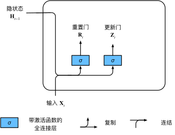
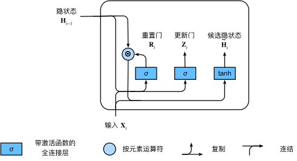
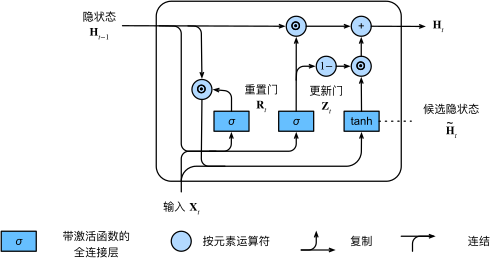

### 门控隐状态

门控循环单元与普通的循环神经网络之间的关键区别在于： 前者支持隐状态的门控。 这意味着模型有专门的机制来确定应该何时更新隐状态， 以及应该何时重置隐状态。 **这些机制是可学习的**。如，如果第一个词元非常重要， 模型将学会在第一次观测之后不更新隐状态。

#### 重置门和更新门

重置门允许我们控制“可能还想记住”的过去状态的数量； 更新门将允许我们控制新状态中有多少个是旧状态的副本。

输入是由当前时间步的输入和前一时间步的隐状态给出。 两个门的输出是由使用sigmoid激活函数的两个全连接层给出

重置门 $\mathbf{R}_t \in \mathbb{R}^{n \times h}$ 和 更新门 $\mathbf{R}_t \in \mathbb{R}^{n \times h}$ 的计算如下所示：
$$
\begin{split}\begin{aligned}
\mathbf{R}_t = \sigma(\mathbf{X}_t \mathbf{W}_{xr} + \mathbf{H}_{t-1} \mathbf{W}_{hr} + \mathbf{b}_r),\\
\mathbf{Z}_t = \sigma(\mathbf{X}_t \mathbf{W}_{xz} + \mathbf{H}_{t-1} \mathbf{W}_{hz} + \mathbf{b}_z),
\end{aligned}\end{split}
$$

#### 候选隐状态

将重置门 $\mathbf{R}_t$ 与常规隐状态更新机制集成得到时间 $t$ 步的候选隐状态
$$
\tilde{\mathbf{H}}_t = \tanh(\mathbf{X}_t \mathbf{W}_{xh} + \left(\mathbf{R}_t \odot \mathbf{H}_{t-1}\right) \mathbf{W}_{hh} + \mathbf{b}_h),
$$
上式中，$\mathbf{R}_t$和 $\mathbf{H}_{t-1}$ 的元素相乘可以**减少以往状态的影响**。当重置门接近1时，与常规循环网络一样，接近0时，则候选状态主要与输入相关。

#### 隐状态

上述的计算结果只是候选隐状态，我们仍然需要结合更新门 $\mathbf{Z}_t$ 的效果。门控循环单元的最终更新公式
$$
\mathbf{H}_t = \mathbf{Z}_t \odot \mathbf{H}_{t-1}  + (1 - \mathbf{Z}_t) \odot \tilde{\mathbf{H}}_t.
$$
当更新门接近1时，模型倾向保留旧状态，此时来自 $\mathbf{X}_t$ 的信息基本被忽略。当接近0时，新的隐状态 $\mathbf{H}_t$ 会接近候选隐状态 $\tilde{\mathbf{H}}_t$。

这些设计可以帮助我们处理循环神经网络中的梯度消失问题， 并更好地捕获时间步距离很长的序列的依赖关系。

总之，门控循环单元具有以下两个显著特征：

- 重置门有助于捕获序列中的短期依赖关系；
- 更新门有助于捕获序列中的长期依赖关系。

